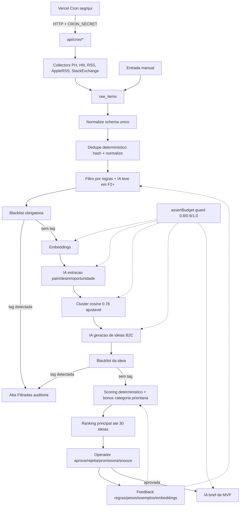
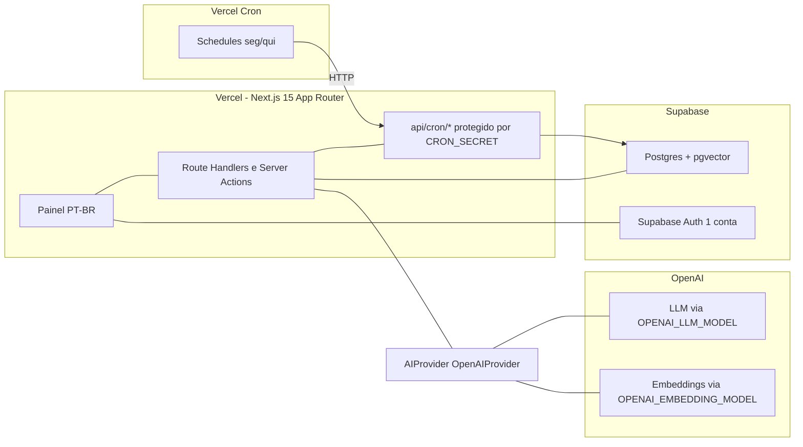
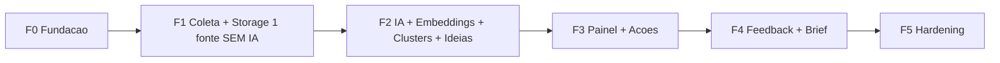

# GoMVP V1 — PRD

> **Versão:** 1.0
> **Status:** decisões D-01 a D-10 fechadas; pronto para F0 sob aprovação.
> **Owner:** Built2Go (operador único).
> **Última revisão:** rodada 6 (ajustes de blacklist, F1 sem IA, Vercel Cron).

---

## 1. Visão do produto

GoMVP é o **radar automático de oportunidades B2C** da Built2Go. Transforma posts, perguntas, lançamentos e rankings de fontes públicas com API/RSS em **ideias rastreáveis de microprodutos**, ordenadas por potencial e ligadas à evidência que as gerou. Não valida mercado: prioriza com evidência. Validação real só ocorre com clique, cadastro, uso, retorno, pagamento ou compartilhamento reais — **fora** do escopo do GoMVP.

## 2. Problema

- Operador da Built2Go gasta horas/dia garimpando PH, HN, Reddit, YouTube, Google e diretórios.
- Processo viesado, pouco rastreável, insustentável para 1 pessoa.
- Ferramentas existentes são caras, focadas em SaaS/B2B ou exigem interpretação manual.
- Falta um pipeline que entregue 30 ideias B2C/semana com sinais brutos anexados, em PT e EN.

## 3. Objetivo

Entregar, com pipeline automático **2x/semana (segunda e quinta)**, um **ranking de até 30 ideias B2C** com evidência clicável, operável por 1 pessoa, com **hard cap de IA em US$ 50/mês**.

KPIs guiadores:

- Top-10 julgado "vale ler" ≥ 70%.
- ≥ 1 ideia aprovada/semana.
- Tempo de operação ≤ 30 min/dia.
- Custo IA real ≤ US$ 50/mês (kill switch obrigatório).

## 4. Público / usuário

Operador único da Built2Go. Não é multi-tenant, não é produto público. **Auth via Supabase Auth, 1 conta operadora.**

## 5. Job-to-be-done

> "Quando estou decidindo o que construir esta semana, quero receber um ranking automático de microprodutos B2C com evidência de dor real, em PT e EN, para gastar meu tempo construindo MVP em vez de garimpando feeds."

## 6. Escopo da V1

1. Coletores automáticos: Product Hunt API, Algolia HN, RSS configurável, Apple RSS rankings, Stack Exchange API.
2. Entrada manual opcional via formulário.
3. Pipeline: normalize → dedupe determinístico → filtro híbrido (regras + IA leve em F2+) → **blacklist obrigatória** → embeddings → extração IA → clusterização (pgvector) → geração de ideias → scoring determinístico.
4. Painel web em PT-BR com: dashboard, ranking principal (até 30), aba **Filtradas** (auditoria), detalhe da ideia, ações (aprovar/rejeitar/promissora/snooze/nota), runs, custos, fontes (CRUD), pesos, sinais (debug), clusters, prompts (read-only), blacklist (CRUD).
5. **Brief de MVP sob demanda apenas para ideias aprovadas.**
6. Loop de feedback **sem treinar modelo**: regras, pesos, exemplos few-shot, embeddings de preferência.
7. Logs de runs, custos por chamada IA, prompts versionados.

### 6.1 Política de categorias B2C

**Aceitar B2C amplo, com blacklist obrigatória e priorização explícita** de tipos web-first, simples, baixo suporte, baixo risco e MVP claro.

**Tipos priorizados** (bônus de score determinístico):
`utility`, `ai_tool`, `calculator`, `generator`, `checker`, `organizer`.

**Blacklist obrigatória** (categorias que tiram a ideia do ranking principal e mandam para a aba **Filtradas** apenas para auditoria):

- `gambling` — gambling, betting, apostas, casino, lottery
- `crypto_finance` — cripto, trading, day-trade, investimento financeiro, banking
- `regulated_health` — saúde regulada, diagnóstico, tratamento, prescrição, prontuário
- `regulated_legal` — jurídico regulado, prática de advocacia, peças processuais
- `regulated_finance` — produtos financeiros regulados (CVM/BCB), crédito, seguros
- `adult` — adulto, pornografia, dating sexualizado
- `regulated_substances` — álcool, tabaco, cannabis, fármacos controlados
- `weapons` — armas, munições
- `marketplace` — marketplace de qualquer lado
- `social_network` — rede social, comunidade, fórum como produto principal
- `mobile_native_required` — produtos que exigem app nativo obrigatório
- `b2b_enterprise` — vendas enterprise, contrato anual, sales team
- `recurring_human_support` — produtos com SLA de atendimento humano contínuo
- `high_customization` — produtos com forte customização por cliente
- `complex_integrations_required` — dependência de integrações complexas antes da validação
- `sensitive_personal_data` — coleta de dados pessoais sensíveis (CPF, biometria, saúde, criança)

**Regras de ranking:**

- Itens com `blacklist_tags` não vazio **saem do ranking principal**.
- Itens filtrados ficam na aba **Filtradas**, somente para auditoria.
- Score só é exibido no ranking principal.
- Operador pode reverter manualmente um item específico, com nota obrigatória, para o ranking principal (decisão consciente).

## 7. Fora de escopo

- Scraping pesado, headless browser para sites externos, parsing de páginas sem API/RSS.
- Reddit, YouTube em escala, Google Trends como dependência, App Store/Play Store reviews.
- App mobile nativo, extensão de browser, marketplace, multi-tenant, billing, white-label.
- Treinamento de modelo / fine-tuning.
- Validação automática de mercado, publicação de landing real, integrações com analytics/CRM/e-mail externos.

## 8. Fontes de coleta recomendadas

Aprovadas V1 (todas via API/RSS oficial, sem scraping):

- **Product Hunt API** (GraphQL).
- **Algolia HN Search API** (Ask HN, Show HN, trending).
- **RSS feeds configuráveis** (Indie Hackers, BetaList, Dev.to por tag, newsletters públicas).
- **Apple RSS rankings** (top free/paid/grossing por categoria/país).
- **Stack Exchange API** (perguntas com muitas views e poucas respostas como sinal forte).
- **Entrada manual** via formulário (auxiliar).

Fora da V1 (revisar depois): Reddit, YouTube, Google Trends, scraping de reviews, X/Twitter.

## 9. Fluxo funcional completo



## 10. Requisitos funcionais

- RF-01. Coletas executadas em schedule configurável por fonte; default 2x/semana global.
- RF-02. Cada item preserva `source_url`, `source_id`, `source_name`, `collected_at`, `raw_payload`.
- RF-03. Normalização para `signals` com `language` (`pt`/`en`/`other`).
- RF-04. Dedupe **determinístico** por hash de URL canonicalizada + hash de texto normalizado (lowercase, trim, sem stopwords). Cosine semântico só entra em F2+ com embeddings.
- RF-05. Filtro híbrido: regras determinísticas (palavras-chave, idioma, tamanho mínimo) e, em F2+, classificador IA leve respeitando guard de orçamento.
- RF-06. **Blacklist obrigatória** aplicada após o filtro: detecta categorias proibidas em `signals` e em `ideas`, grava `blacklist_tags`.
- RF-07. Extração IA em JSON estruturado: `pain`, `desire`, `complaint`, `behavior`, `audience_hint`, `relevance_b2c`, `signal_strength`, `language`, `evidence_quote`.
- RF-08. Clusterização por cosine ≥ 0.78, threshold ajustável em `weights`.
- RF-09. Geração de até 3 ideias por cluster relevante, em JSON, com todos os campos da regra do GoMVP.
- RF-10. Scoring **determinístico** em código com pesos configuráveis em `weights` + bônus de categoria prioritária (cap +0.05).
- RF-11. Ranking **principal** lista até 30 ideias por execução com filtros (status, fonte, score mínimo, idioma); ideias com `blacklist_tags` não aparecem aqui.
- RF-12. Aba **Filtradas** lista ideias com `blacklist_tags`, somente leitura, com motivo da filtragem.
- RF-13. Ações do operador: aprovar, rejeitar, promissora, snooze (default 30d), nota.
- RF-14. Brief MVP sob demanda apenas para ideias aprovadas, em JSON estruturado, com regerar/copiar.
- RF-15. Logs em `runs` (kind, in/out, cost, status, triggered_by) e `ai_usage_logs` por chamada IA.
- RF-16. Prompts versionados em `prompts`; `prompt_version` salvo em cada chamada.
- RF-17. CRUD de `sources`, `weights`, regras de filtro/scoring e `blacklist_terms`.
- RF-18. Entrada manual de sinal via formulário.
- RF-19. Métricas: itens coletados, ideias geradas/aprovadas/rejeitadas/filtradas, custo IA do mês, fontes ativas.
- RF-20. Operador rotula exemplos positivos/negativos para realimentar filtro/scoring.
- RF-21. **Guard de orçamento** `assertBudget()` aplicado **antes de toda chamada IA**.
- RF-22. Job de retenção LGPD aplica 30/90/180/365d e endpoint de purge por `source_url`.

## 11. Requisitos não funcionais

- **Operacional**: 1 pessoa opera; deploy Vercel + Supabase; rollback simples.
- **Performance**: pipeline processa ≤ 5k itens em ≤ 30 min; listagem do painel < 1s.
- **Custo**: hard cap US$ 50/mês IA; infra Supabase + Vercel ≤ US$ 50/mês.
- **Observabilidade**: log estruturado por run; custo IA por chamada; alertas em warning de orçamento e em falha de coleta consecutiva.
- **Segurança**: 1 conta Supabase Auth; secrets em ENV; nenhuma rota pública sem auth; cron protegido por `CRON_SECRET`.
- **LGPD**: minimização; sem perfis; retenção 30/90/180/365d; purge por URL; política interna documentada.
- **Idempotência**: cada etapa reprocessa sem duplicar saídas.
- **Manutenibilidade**: TypeScript estrito, módulos pequenos, sem abstrações prematuras (camada `AIProvider` é a única abstração obrigatória).

## 12. Riscos técnicos

- Mudanças e rate limits de APIs externas (PH, Stack Exchange, RSS quebrando).
- Qualidade da extração IA em PT/EN misturado.
- Dedupe fraco em textos curtos antes de existir embedding (mitigado em F1 com normalização agressiva; refinado em F2 com cosine).
- Custo IA crescer com volume — mitigado pelo hard cap, cap por fonte e F1 sem IA.
- Drift de prompt sem versionamento — mitigado por `prompts` versionados.
- Filtro removendo sinais bons — mitigado por dry-run, replay e métrica de coerência intra-cluster.
- Blacklist com falsos positivos — mitigado por reversão manual com nota.

## 13. Riscos jurídicos / LGPD

- Respeitar ToS e rate limits de cada API; atribuição de fonte preservada em `source_url`.
- Não persistir dados pessoais sensíveis; username público é referência, não perfil.
- Direito de exclusão: endpoint de purge por `source_url`.
- Retenção: 30d `raw_items`, 90d `signals`, 180d `ideas`/`briefs`, 365d `ai_usage_logs`.
- Política interna documentada (`docs/PRIVACY.md`) registrando finalidade.
- Cuidado com copywriting de evidência envolvendo marcas reais (evitar endosso ou difamação).

## 14. Custos de API/IA esperados

Premissa: ~500 itens/coleta × 2 coletas/semana ≈ 4k itens/mês após F2 ativa IA.

- Coletas: US$ 0 (APIs públicas).
- **F1**: US$ 0 — sem chamadas de IA. Apenas coleta + dedupe determinístico + filtros por regra.
- **F2 em diante**:
  - Embeddings (`text-embedding-3-small`): ~4k × 250 tok ≈ 1M tok/mês → ~US$ 0.02.
  - Filtro IA leve (apenas dúvidos): ~600 chamadas × 200 tok → desprezível.
  - Extração (`gpt-4o-mini`): ~2k × 800 tok in + 200 tok out → ~US$ 0.5.
  - Geração de ideias: ~200 clusters × 1.5k tok in + 800 tok out → ~US$ 0.7.
  - Brief MVP sob demanda: desprezível.

**Estimado: US$ 1.5–4/mês.** Hard cap em US$ 50/mês cobre 10x esse volume com folga.

## 15. Arquitetura sugerida



Stack final:

- **Next.js 15 App Router + TypeScript estrito + Tailwind + shadcn/ui**.
- **Supabase**: Postgres + pgvector + Auth.
- **Drizzle ORM** + drizzle-kit (migrations explícitas).
- **OpenAI** via `OpenAIProvider` que implementa interface `AIProvider`.
- **Vercel** para hospedar; **Vercel Cron** chama `/api/cron/*` com `CRON_SECRET`.
- pg_cron / Supabase Scheduled Functions ficam como **alternativa futura**, não usadas na V1 para evitar mistura de orquestradores.

## 16. Módulos do sistema

**Estrutura flat na raiz** (não usar monorepo nem `apps/web/` na V1):

```text
.
├── docs/
├── public/
├── src/
│   ├── app/
│   │   ├── (dashboard)/        # painel autenticado
│   │   ├── api/cron/           # endpoints disparados pelo Vercel Cron
│   │   ├── login/
│   │   ├── layout.tsx
│   │   └── page.tsx
│   ├── db/                     # schema Drizzle, client, migrations
│   ├── ai/                     # provider.ts, openai.ts, budget.ts
│   ├── collectors/             # 1 arquivo por fonte
│   ├── pipeline/               # normalize, dedupe, filter, blacklist, extract, cluster, ideaGen, score
│   ├── feedback/               # rules, weights, examples, preference
│   ├── lib/                    # auth, runs, logging, helpers
│   └── prompts/                # arquivos por nome+versão, espelhados em tabela prompts
├── drizzle.config.ts
├── next.config.ts
├── package.json
└── tsconfig.json
```

Sem `apps/`, sem workspaces, sem turborepo. Adição de pacotes só quando estritamente necessário.

## 17. Modelo de dados final

> **Quando cada tabela nasce:** F0 cria `runs`, `ai_usage_logs`, `cost_budgets`. F1 cria `sources`, `raw_items`, `blacklist_terms`. **A tabela `signals` só nasce em F2**, junto com a extração IA — em F1 ainda não há `signals` oficial; o que existe são `raw_items` com flags de filtro e blacklist (candidatos).

```sql
-- pgvector habilitado em F2

sources(id, name, kind, config_json jsonb, active bool, created_at)

-- F1: raw_items com flags de filtro e blacklist (candidatos)
raw_items(id, source_id, source_external_id, url text, raw_payload jsonb,
          fetched_at, hash_url text, hash_text_norm text,
          language text,
          is_filtered_out bool default false,
          filter_reason text,
          blacklist_tags text[] default '{}',
          is_candidate bool generated always as
            (NOT is_filtered_out AND cardinality(blacklist_tags) = 0) stored)

-- F2: signals nasce a partir de raw_items aprovados, com extração IA
signals(id, raw_item_id, title, body, author_handle, language text,
        posted_at, metric_score numeric, metric_comments int,
        embedding vector(1536),
        relevance_b2c numeric, signal_strength numeric,
        is_noise bool default false,
        blacklist_tags text[] default '{}',
        status text, created_at)

clusters(id, label text, summary text, centroid vector(1536),
         size int, coherence_score numeric, created_at)

signal_cluster(signal_id, cluster_id, primary_signal bool default false,
               PRIMARY KEY (signal_id, cluster_id))

ideas(id, cluster_id, name, pain, audience, evidence_json jsonb,
      promise, product_type, mvp, channel, monetization,
      support_level, lgpd_risk, build_difficulty, distribution_potential,
      subscores jsonb, total_score numeric, justification, next_step,
      status text, language text, prompt_version text,
      blacklist_tags text[] default '{}',
      is_filtered_out bool generated always as
        (cardinality(blacklist_tags) > 0) stored,
      created_at)

idea_signals(idea_id, signal_id, PRIMARY KEY (idea_id, signal_id))

briefs(id, idea_id, content_json jsonb, prompt_version text, created_at)

runs(id, kind text, started_at, finished_at, status text,
     items_in int, items_out int, cost_usd numeric, error text,
     triggered_by text)                        -- 'cron'|'manual'
-- "collection_runs" sao runs com kind='collect_*'

ai_usage_logs(
  id, run_id, operation text, source text, model text,
  tokens_in int, tokens_out int, embedding_count int default 0,
  estimated_cost_usd numeric(10,6),
  related_entity_type text, related_entity_id text,
  prompt_version text, status text, latency_ms int, created_at)

cost_budgets(
  id, period_month date, monthly_budget_usd numeric(10,2),
  warning_threshold numeric(3,2),
  stop_auto_threshold numeric(3,2),
  hard_stop_threshold numeric(3,2),
  current_spend_usd numeric(10,6) default 0,
  status text, updated_at)

prompts(id, name text, version text, content text, created_at,
        UNIQUE(name, version))

feedback(id, idea_id, action text, reason text,
         weights_delta jsonb, example_label text, created_at)

weights(id, name text UNIQUE, value numeric, updated_at)

blacklist_terms(
  id, term text, category text,
  scope text default 'all',                    -- 'signal'|'idea'|'all'
  language text default 'all',                 -- 'pt'|'en'|'all'
  match_kind text default 'keyword',           -- 'keyword'|'regex'
  active bool default true, created_at)
```

Índices: `signals.embedding` ivfflat (criado em F2); `raw_items(hash_url)`, `raw_items(hash_text_norm)`; `ideas.total_score DESC`; `ideas(is_filtered_out)`; `runs(started_at DESC)`; `ai_usage_logs(created_at, operation)`; GIN em `signals.blacklist_tags` e `ideas.blacklist_tags`.

## 18. Telas necessárias (PT-BR)

1. **Login** — Supabase Auth.
2. **Dashboard** — métricas, estado de orçamento, alertas, atalhos.
3. **Ranking** — top 30 do principal, filtros (status, fonte, score mínimo, idioma, tipo).
4. **Filtradas** — auditoria das ideias com `blacklist_tags`, motivo, botão de reversão manual com nota.
5. **Detalhe da ideia** — campos completos + evidência clicável + ações.
6. **Brief MVP** — visível só após aprovação; gerar/regerar/copiar.
7. **Sinais** — explorer.
8. **Clusters** — ver clusters e seus sinais.
9. **Runs** — histórico, custo, erro.
10. **Custos** — gasto vs. budget, breakdown por operação/fonte, últimas 50 `ai_usage_logs`.
11. **Sources** — CRUD.
12. **Weights** — edição de pesos com botão "recalcular scores".
13. **Blacklist** — CRUD de `blacklist_terms` com seed inicial.
14. **Prompts** — read-only (edição via repo).

## 19. Lógica de scoring

`total_score = clamp(Σ weight_i × subscore_i + category_bonus, 0, 1)`

Subscores fornecidos pela IA em P-IDE-001 (0..1):
`pain_clarity`, `b2c_fit`, `audience_specificity`, `build_simplicity`, `distribution_potential`, `support_low`, `lgpd_safety`, `evidence_volume`, `signal_strength`, `recency`.

Pesos default em `weights` (somam 1.0):
`pain_clarity 0.18`, `b2c_fit 0.15`, `evidence_volume 0.12`, `signal_strength 0.10`, `audience_specificity 0.10`, `build_simplicity 0.10`, `distribution_potential 0.08`, `recency 0.07`, `support_low 0.05`, `lgpd_safety 0.05`.

`category_bonus` (default em `weights`, valor `0.05`): aplicado quando `product_type ∈ {utility, ai_tool, calculator, generator, checker, organizer}`. Soma ao total e fica clipado em [0,1].

Score recalculável on-demand sem regerar IA.

## 20. Lógica de feedback humano

Quatro mecanismos compostos, **sem treinar modelo**:

1. **Regras** editáveis (filtro/scoring/blacklist) avaliadas antes da IA.
2. **Pesos** ajustáveis em `weights` com recálculo on-demand.
3. **Exemplos few-shot**: top N aprovados/rejeitados injetados em P-IDE-001 e P-FIL-001.
4. **Embeddings de preferência**: centroides de aprovadas/rejeitadas em `feedback`. Subscore `preference_affinity` derivado e somado como bônus/penalidade fora do peso (cap ±0.05) para evitar dominar.

Métrica: precisão do top-10 ao longo do tempo.

## 21. Como MCP será usado no desenvolvimento (não em runtime)

- **Context7 (configurado)** — Docs Next.js 15, Supabase, pgvector, Drizzle, OpenAI SDK, RSS parsers. Não é runtime.
- **Supabase MCP (a configurar)** — Leitura do schema de **dev**, validar migrations geradas, explorar dados de teste. Nunca produção, nunca mass updates, migrations sempre exibidas antes de aplicar.
- **GitHub MCP (a configurar)** — Consulta a issues/branches/PRs do repo. Nenhum push, PR ou commit sem aprovação explícita.
- **Playwright (configurado)** — Smoke tests E2E do painel local quando UI existir (F3+). Nunca scraping externo, nunca produção.

Nenhum MCP é dependência runtime. Toda integração de produção é via SDK direto ou fetch da API pública.

## 22. Critérios de sucesso (8 semanas após GA interno)

- Pipeline roda 2x/semana sem intervenção em ≥ 90% das execuções.
- ≥ 70% do top-10 julgado "vale ler".
- ≥ 4 ideias aprovadas/mês.
- ≥ 1 MVP construído/mês a partir do GoMVP.
- Custo IA real ≤ US$ 50/mês (hard cap nunca disparado em condição normal).
- Operação ≤ 30 min/dia.

## 23. Critérios kill / iterate / scale

**Kill** (descontinuar V1 e repensar):

- Após 6 semanas, < 30% do top-10 é útil.
- Hard cap dispara repetidamente em volume normal.
- Operador gasta > 1h/dia.
- ≥ 2 fontes principais quebram sem substituto viável.

**Iterate**:

- Top-10 entre 30–70% útil.
- Custo controlado, mas pipeline com gargalos.
- Filtro/cluster precisam recalibração.

**Scale**:

- Top-10 ≥ 70% útil estável.
- ≥ 1 MVP/mês validado por métrica real.
- Demanda interna por mais fontes / multi-operador.

## 24. Plano incremental de implementação



- **F0 Fundação (1–2 dias)**: repo, Next.js 15, Supabase + pgvector, Drizzle, Auth, `runs`/`ai_usage_logs`/`cost_budgets`, `AIProvider`+`OpenAIProvider`, `assertBudget`, deploy mínimo. **Vercel Cron configurado vazio**.
- **F1 Coleta + Storage (3–5 dias) — sem IA, sem embeddings, sem custo IA. Entrega visual: "Coleta / Raw Items / Candidatos" (não há `signals` ainda)**:
  - Tabelas `sources`, `raw_items` (com flags `is_filtered_out`, `filter_reason`, `blacklist_tags`, `is_candidate`).
  - Tabela `blacklist_terms` com seed inicial.
  - Coletor Algolia HN ponta-a-ponta.
  - **Dedupe determinístico** por `hash_url` + `hash_text_norm` (lowercase, trim, remoção de stopwords, normalização Unicode).
  - **Filtros por regra** (idioma, tamanho mínimo, palavras-chave bloqueadas) gravando em `raw_items`.
  - **Blacklist obrigatória** aplicada via keyword/regex de `blacklist_terms` gravando em `raw_items.blacklist_tags`.
  - **Tela "Coleta / Raw Items / Candidatos"** somente leitura, com filtros por status (todos / filtrados / candidatos / blacklist) e link para fonte.
  - Logs em `runs` (kind `collect_hn`).
  - **Vercel Cron seg/qui** chamando `/api/cron/collect-hn` com `CRON_SECRET`.
- **F2 IA + Embeddings + Clusters + Ideias (4–6 dias). HN-only no início; demais coletores entram incrementalmente**:
  - Habilitar extensão `pgvector`.
  - **Tabela `signals` nasce aqui**, populada a partir de `raw_items` candidatos.
  - Tabelas `clusters`, `signal_cluster`, `ideas`, `idea_signals`, `briefs`, `weights` (com seed), `prompts`.
  - Coluna `embedding` em `signals` + índice ivfflat.
  - Embeddings via `assertBudget()` + `ai_usage_logs`.
  - Prompt P-EXT-001 + `extract.ts`.
  - Prompt P-FIL-001 + filtro híbrido (regras + IA leve).
  - Cluster por cosine + P-CLU-001.
  - Prompt P-IDE-001 + `ideaGen.ts`.
  - Blacklist re-aplicada nas ideias.
  - Scorer determinístico + `category_bonus`.
  - Testes manuais dos thresholds 0.80/0.90/1.00.
  - **Coletores adicionais** (Product Hunt, RSS, Apple RSS, Stack Exchange, manual) **entram um por vez sob aprovação**, depois que HN estiver estável de ponta-a-ponta. Não implementar todos de uma vez.
- **F3 Painel + Ações (3–4 dias)**: dashboard, ranking principal, **aba Filtradas**, detalhe, ações, tela de custos, sources, weights, blacklist (CRUD).
- **F4 Feedback + Brief (3–4 dias)**: `feedback`, regras, few-shot dinâmico, embeddings de preferência, P-BRF-001, tela Brief.
- **F5 Hardening (2–3 dias)**: kill switch testado, retries, alertas, retenção LGPD + purge, RUNBOOK, backup.

Total estimado: ~3 a 4 semanas, 1 dev full-time.

### Gates por fase

- **F0**: deploy 200, DB conectado, `pgvector` ativo, auth funciona, linha de `cost_budgets` do mês criada, `assertBudget()` testado, Vercel Cron registrado vazio.
- **F1**: ≥ 100 raw_items por execução HN **ou** ≥ 50 candidatos pós-filtro por execução; dedupe < 5% duplicatas; **custo IA = US$ 0** (zero chamada IA na fase).
- **F2**: ≥ 20 ideias/execução em JSON válido; threshold de orçamento bloqueia em teste; `ai_usage_logs` populando.
- **F3**: 30 ideias revisadas em ≤ 30 min; aba Filtradas mostra itens com motivo.
- **F4**: 2 ciclos de feedback movem precisão do top-10; brief gerado em < 30s para 5 ideias aprovadas.
- **F5**: hard cap dispara em teste; alerta chega; purge LGPD limpa janela; backup restaura em sandbox.

## 25. Perguntas em aberto

Restaram apenas pontos menores que não bloqueiam F0:

1. Idiomas iniciais dos coletores PT vs EN — qual proporção alvo?
2. Lista inicial de RSS feeds (favoritos do operador?).
3. Categorias Apple RSS e países iniciais (sugestão: US + BR; "Productivity", "Utilities", "Education").
4. Sites Stack Exchange além de StackOverflow (sugestão: SuperUser, Webmasters, Productivity, Workplace).
5. Email/webhook para alertas — quais endereços?
6. Seed inicial de termos da blacklist por categoria — confirmar lista de keywords PT+EN ou aceitar default proposto.

## 26. Decisões fechadas (registro de aprovação)

- **D-01** Stack: Supabase (Postgres + pgvector + Auth). _Aprovado rodada 2._
- **D-02** IA: OpenAI somente, modelos via ENV, camada `AIProvider` abstrata. _Aprovado rodada 3._
- **D-03** Idioma: coleta PT + EN, painel PT-BR. _Aprovado rodada 2._
- **D-04** Ranking: 2x/semana (seg/qui). _Aprovado rodada 3._
- **D-05** Auth: Supabase Auth, 1 conta. _Tácito por D-01._
- **D-06** Cron: **Vercel Cron** + Route Handlers `/api/cron/*` + `CRON_SECRET`. pg_cron como alternativa futura. _Aprovado rodada 6._
- **D-07** ORM: Drizzle. _Aprovado rodada 4._
- **D-08** Cap: hard US$ 50/mês com `ai_usage_logs` + `cost_budgets` (0.80/0.90/1.00). _Aprovado rodada 4._
- **D-09** Retenção: 30d raw, 90d signals, 180d ideas/briefs, 365d ai_usage_logs. _Aprovado rodada 5._
- **D-10** Categorias: **B2C amplo, com blacklist obrigatória e priorização** de utility/tool/calc/generator/checker/organizer. Itens com `blacklist_tags` saem do ranking principal e ficam em aba Filtradas (auditoria). _Aprovado rodada 6._

Nenhuma decisão crítica em aberto.

---

## Apêndice A — Resumo executivo

GoMVP V1 é um radar automático que coleta sinais B2C de PH, HN, RSS, Apple RSS e Stack Exchange via API/RSS, deduplica de forma determinística, aplica blacklist obrigatória, extrai dores com IA, agrupa por similaridade vetorial, gera até 30 ideias rankeadas 2x/semana com evidência clicável, e permite ao operador único da Built2Go aprovar/rejeitar/promissora/snooze. Apenas ideias aprovadas geram brief de MVP. Custo IA é hard-capped em US$ 50/mês com kill switch. Stack: Next.js 15 + Supabase + Drizzle + OpenAI. Vercel Cron orquestra. Sem scraping, sem mobile nativo, sem treino de modelo.

## Apêndice B — Tarefas técnicas por fase

### F0 Fundação

- [ ] Repositório privado no GitHub.
- [ ] Next.js 15 + TS estrito + Tailwind + shadcn/ui + ESLint/Prettier.
- [ ] Projeto Supabase (dev) com `pgvector` habilitado + Auth (1 conta).
- [ ] Drizzle + drizzle-kit, primeira migration vazia.
- [ ] `.env.example`: `DATABASE_URL`, `SUPABASE_URL`, `SUPABASE_ANON_KEY`, `SUPABASE_SERVICE_ROLE`, `OPENAI_API_KEY`, `OPENAI_LLM_MODEL`, `OPENAI_EMBEDDING_MODEL`, `APP_BASE_URL`, `CRON_SECRET`, `AUTH_SECRET`.
- [ ] Tabelas `runs`, `ai_usage_logs`, `cost_budgets` + seed do mês corrente (US$ 50, 0.80/0.90/1.00).
- [ ] Interface `AIProvider` + `OpenAIProvider` + helper `assertBudget()`.
- [ ] Deploy mínimo no Vercel + Supabase conectado + Vercel Cron registrado vazio.

### F1 Coleta + Storage (sem IA, sem `signals`)

- [ ] Tabelas `sources`, `raw_items` (com flags), `blacklist_terms` com seed.
- [ ] Coletor `algolia-hn.ts` paginado com cap diário e log em `runs`.
- [ ] Normalizador HN → `raw_items` (sem `signals` nesta fase).
- [ ] Dedupe determinístico (`hash_url`, `hash_text_norm`).
- [ ] Filtro por regra (idioma, tamanho mínimo, keywords) gravando em `raw_items`.
- [ ] Blacklist por keyword/regex gravando em `raw_items.blacklist_tags`.
- [ ] Tela "Coleta / Raw Items / Candidatos" somente leitura.
- [ ] Vercel Cron seg/qui chamando `/api/cron/collect-hn` com `CRON_SECRET`.

### F2 IA + Embeddings + Clusters + Ideias (HN-only no início)

- [ ] Habilitar `pgvector`.
- [ ] Migration: tabela `signals` (nasce aqui) + `embedding` + índice ivfflat.
- [ ] Tabelas `clusters`, `signal_cluster`, `ideas`, `idea_signals`, `briefs`, `weights` (seed), `prompts`.
- [ ] Embeddings via `assertBudget()` + `ai_usage_logs`.
- [ ] Prompt P-EXT-001 + `extract.ts` (gera `signals` a partir de `raw_items` candidatos).
- [ ] Prompt P-FIL-001 + filtro híbrido.
- [ ] Cluster por cosine ≥ 0.78 + P-CLU-001.
- [ ] Prompt P-IDE-001 + `ideaGen.ts`.
- [ ] Re-aplicação de blacklist em `ideas`.
- [ ] Scorer determinístico + `category_bonus`.
- [ ] Testes manuais dos thresholds 0.80/0.90/1.00.
- [ ] **Coletores adicionais** entram um por vez, sob aprovação, após HN estabilizar.

### F3 Painel + Ações

- [ ] Dashboard.
- [ ] Tela Ranking principal com filtros.
- [ ] Aba Filtradas com motivo de blacklist.
- [ ] Detalhe da ideia com evidência clicável e ações.
- [ ] Tela Custos.
- [ ] Telas Sources, Weights, Blacklist (CRUD).

### F4 Feedback + Brief

- [ ] Tabela `feedback` + ações registrando `weights_delta`.
- [ ] Regras editáveis (filtro/scoring/blacklist).
- [ ] Few-shot dinâmico em P-IDE-001 e P-FIL-001.
- [ ] Embeddings de preferência (cap ±0.05).
- [ ] Prompt P-BRF-001 + tela Brief MVP.

### F5 Hardening

- [ ] Kill switch hard cap testado E2E.
- [ ] Retries idempotentes.
- [ ] Alertas e-mail/webhook.
- [ ] Job de retenção 30/90/180/365d + endpoint de purge.
- [ ] `RUNBOOK.md` + backup do banco.

## Apêndice C — Checklist de gates

- **F0**: deploy 200, DB conectado, `pgvector` ativo, auth, `cost_budgets` linha do mês, `assertBudget()` testado, Vercel Cron registrado vazio.
- **F1**: ≥ 100 raw_items/execução **ou** ≥ 50 candidatos pós-filtro/execução; dedupe < 5%; **IA = US$ 0**.
- **F2**: ≥ 20 ideias/execução em JSON válido; threshold de orçamento bloqueia em teste.
- **F3**: 30 ideias revisadas em ≤ 30 min; aba Filtradas mostra motivos.
- **F4**: 2 ciclos de feedback movem top-10; brief em < 30s para 5 aprovadas.
- **F5**: hard cap dispara em teste; alerta chega; purge limpa janela; backup restaura.

## Apêndice D — Prompts de IA (V1)

Versão `001` para todos. `prompt_version` salvo em cada `ai_usage_logs`. Modelos lidos de `OPENAI_LLM_MODEL` e `OPENAI_EMBEDDING_MODEL`.

### P-FIL-001 — Filtro de ruído

```
Classifique se o item e ruido para um radar B2C de microprodutos.
Ruido: release corporativo, vaga, autopromocao, hype, noticia generica, off-topic.
Sinal: dor de usuario final, duvida recorrente, reclamacao, comportamento repetido.
Aceite itens em portugues e ingles. Se idioma nao for pt nem en, marque language="other".

Saida JSON estrito:
{ "is_noise": boolean, "language": "pt|en|other", "reason": string }

Item:
TITLE: <<<TITLE>>>
URL: <<<URL>>>
EXCERPT: <<<BODY_FIRST_300_CHARS>>>

Devolva apenas o JSON.
```

### P-EXT-001 — Extração de sinais

```
Voce analisa conteudo publico (posts, perguntas, lancamentos, comentarios) em
portugues ou ingles para detectar dores, desejos, reclamacoes e oportunidades B2C.
Nao invente. So preencha campos com base no texto recebido. Use null quando nao houver evidencia.
NAO infira identidade pessoal. NAO inclua dados sensiveis.
Detecte e devolva o idioma em "language".

Schema de saida:
{
  "language": "pt|en|other",
  "is_b2c_relevant": boolean,
  "relevance_b2c": number 0..1,
  "signal_strength": number 0..1,
  "pain": string|null,
  "desire": string|null,
  "complaint": string|null,
  "behavior": string|null,
  "audience_hint": string|null,
  "topic_tags": string[],
  "noise_reason": string|null,
  "evidence_quote": string|null
}

Criterios:
- is_b2c_relevant=false para release corporativo, vaga, autopromocao, hype puro.
- signal_strength alto quando ha dor clara, repetida e publico implicito especifico.
- evidence_quote deve ser citacao literal curta do item.

Item:
TITLE: <<<TITLE>>>
BODY: <<<BODY>>>
URL: <<<URL>>>
SOURCE: <<<SOURCE_NAME>>>
POSTED_AT: <<<POSTED_AT>>>

Devolva apenas o JSON.
```

### P-CLU-001 — Resumo de cluster

```
Voce recebe N sinais agrupados por similaridade semantica (mistura de pt e en).
Resuma o que une o cluster, sem inventar. Responda em portugues.

Schema:
{
  "label": string (3-6 palavras),
  "summary": string (1-3 frases),
  "common_pain": string|null,
  "common_audience": string|null,
  "topic_tags": string[],
  "coherence_score": number 0..1
}

Sinais:
<<<LIST_OF_SIGNALS_WITH_QUOTES>>>

Devolva apenas o JSON.
```

### P-IDE-001 — Geração de ideias B2C

```
Voce gera ideias de microprodutos B2C para a Built2Go.
A Built2Go faz utility apps, ferramentas com IA, calculadoras, geradores,
organizadores e checkers, web-first, baixo suporte.
Ideia deve ser construivel em <= 2 semanas por 1 pessoa.
Ideias podem ser em portugues ou ingles; preencha "language" coerentemente.

Restricoes obrigatorias (nao gerar ideias destas categorias):
gambling, cripto/trading, saude/diagnostico/tratamento regulado,
juridico regulado, financeiro regulado, adulto/dating sexualizado,
substancias controladas, armas, marketplace, rede social/comunidade
como produto principal, mobile nativo obrigatorio, B2B enterprise,
suporte humano recorrente, alta customizacao por cliente, integracoes
complexas pre-validacao, coleta de dados pessoais sensiveis.

Few-shot aprovados (positivos):
<<<APPROVED_EXAMPLES>>>

Few-shot rejeitados (negativos):
<<<REJECTED_EXAMPLES>>>

Cluster:
<<<CLUSTER_LABEL_SUMMARY_AND_SIGNALS>>>

Devolva ate 3 ideias em JSON estrito:
{
  "ideas": [
    {
      "language": "pt|en|other",
      "name": string,
      "pain": string,
      "audience": string,
      "evidence": [{"signal_id": string, "quote": string, "url": string}],
      "promise": string,
      "product_type": "utility|ai_tool|calculator|generator|checker|organizer|other",
      "mvp": string,
      "channel": string,
      "monetization": "free|donation|one_time|subscription|usage|other",
      "support_level": "low|medium|high",
      "lgpd_risk": "low|medium|high",
      "build_difficulty": "low|medium|high",
      "distribution_potential": "low|medium|high",
      "subscores": {
        "pain_clarity": 0..1,
        "b2c_fit": 0..1,
        "audience_specificity": 0..1,
        "build_simplicity": 0..1,
        "distribution_potential": 0..1,
        "support_low": 0..1,
        "lgpd_safety": 0..1,
        "evidence_volume": 0..1,
        "signal_strength": 0..1,
        "recency": 0..1
      },
      "justification": string,
      "next_step": string
    }
  ]
}

Devolva apenas o JSON.
```

### P-SCO-001 — Scoring

**Não há prompt dedicado.** Scoring é determinístico em código a partir dos `subscores` do P-IDE-001 e dos pesos em `weights`. Inclui `category_bonus` (cap +0.05) para `product_type ∈ {utility, ai_tool, calculator, generator, checker, organizer}` e ajuste de preferência (cap ±0.05) baseado em embeddings de aprovadas/rejeitadas.

### P-BRF-001 — Brief de MVP (apenas ideias aprovadas)

```
Voce e arquiteto de microprodutos B2C web-first.
Gere um brief de MVP para a ideia aprovada. Mantenha simplicidade, baixo suporte e LGPD.
Responda no idioma da ideia (pt ou en) sinalizado em "language".

Restricoes:
- 1 a 5 telas no MVP.
- Stack default: Next.js + Supabase + Tailwind + shadcn.
- Monetizacao compativel com baixo suporte.
- Sem dependencias instaveis. Sem scraping.

Ideia aprovada:
<<<IDEA_JSON>>>

Schema de saida JSON estrito:
{
  "language": "pt|en|other",
  "objective": string,
  "hypothesis": string,
  "audience": string,
  "promise": string,
  "screens": string[],
  "features": string[],
  "stack": {"frontend": string, "backend": string, "data": string, "ai": string|null},
  "landing_copy": {"hero": string, "subhero": string, "bullets": string[], "cta": string},
  "test_channels": string[],
  "metrics": {"north_star": string, "secondary": string[], "guardrails": string[]},
  "decision_criteria": {"kill": string, "iterate": string, "scale": string},
  "tech_risks": string[],
  "api_costs": string,
  "limitations": string[],
  "lgpd_notes": string
}

Devolva apenas o JSON.
```

---

## Apêndice E — Princípios operacionais permanentes

- Estrutura **flat** (`src/...` na raiz). Sem monorepo na V1.
- Antes de implementar uma fase, **mostrar o resumo dos arquivos** que serão criados/alterados.
- Migrations sempre **exibidas em SQL antes de aplicar**, e aplicadas só após aprovação.
- Nenhum commit, PR ou push sem aprovação explícita.
- Nenhum MCP é dependência runtime do GoMVP.
- Toda chamada de IA passa por `assertBudget()` e grava `ai_usage_logs`.
- Prompts versionados; `prompt_version` salvo em cada chamada.
- F1 **não roda IA paga** e **não cria `signals`**. IA e `signals` começam em F2.
- F2 começa **HN-only**; demais coletores entram **um por vez**, sob aprovação.
- Blacklist sempre ativa após F1; ranking principal só mostra itens sem `blacklist_tags`.
- Vercel Cron é o **único orquestrador** na V1.
