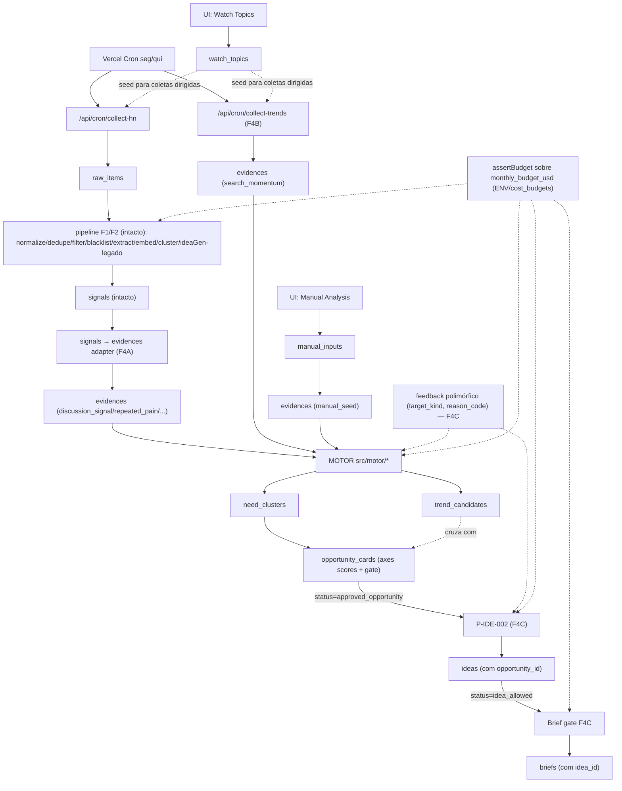
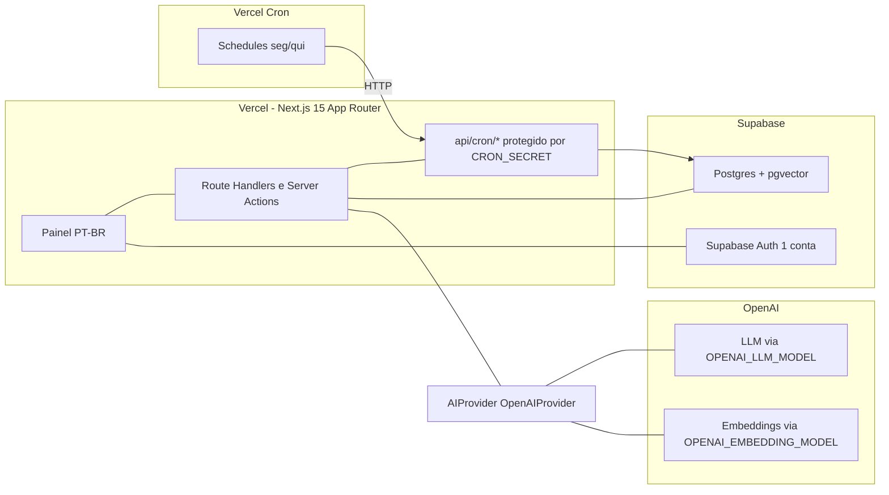

# GoMVP V1 — PRD

> **Versão:** 1.1 (rodada 7).
> **Status:** decisões D-01 a D-16 fechadas. F0/F1/F2/F3 entregues e revisadas. Próximo gate: F4A (sob aprovação).
> **Owner:** Built2Go (operador único).
> **Última revisão:** rodada 7 + ajuste 2026-05-09 (cap IA D-16 = alvo operacional F4/F5 configurável por ENV/banco; sem backfill F4A; badge baixa confiança em qualified HN-only).

---

## 1. Visão do produto

GoMVP é o **motor automático de oportunidades B2C** da Built2Go. Capta sinais públicos de discussão, busca, oferta, conteúdo e reclamação a partir de fontes com API/RSS oficial; transforma cada sinal em **evidência tipada** (`Evidence`) source-agnostic; agrega evidências em **oportunidades** com scores multi-axis (Trend / Pain / Audience / Source Confidence / Launchability / Opportunity); e só permite **gerar ideia** depois que a oportunidade for aprovada pelo operador, e só permite **gerar brief de MVP** depois que a ideia for aprovada.

A unidade central do produto é **`opportunity`**, não `idea`.

> *"Você ganha dinheiro resolvendo dor dos outros. O GoMVP precisa encontrar dor/necessidade antes de sugerir produto."*

GoMVP **não valida mercado automaticamente**. Scores de IA são prioridade, não prova. Validação real só ocorre com clique, cadastro, uso, retorno, pagamento ou compartilhamento reais — **fora** do escopo do GoMVP. O produto deve poder dizer: **"não há oportunidade suficiente aqui"**.

A arquitetura técnica detalhada do motor está em [`docs/architecture/F4_OPPORTUNITY_MOTOR.md`](architecture/F4_OPPORTUNITY_MOTOR.md). Roadmap de fontes em [`docs/architecture/F5_SOURCE_EXPANSION.md`](architecture/F5_SOURCE_EXPANSION.md).

## 2. Problema

- Operador da Built2Go gasta horas/dia garimpando PH, HN, Reddit, YouTube, Google e diretórios.
- Processo viesado, pouco rastreável, insustentável para 1 pessoa.
- Ferramentas existentes são caras, focadas em SaaS/B2B ou exigem interpretação manual.
- Falta um pipeline que entregue 30 ideias B2C/semana com sinais brutos anexados, em PT e EN.

## 3. Objetivo

Entregar, com pipeline automático **2x/semana (segunda e quinta)** + **análise manual on-demand**, um **funil de até 30 oportunidades B2C** com evidência clicável e cross-source confidence, operável por 1 pessoa, com **teto operacional de IA** na faixa de **US$ 5/mês durante a validação F4/F5 do motor** (D-16). O valor efetivo do cap mensal é **configurável** via variável de ambiente e `cost_budgets.monthly_budget_usd` — não é constante hardcoded no produto.

KPIs guiadores:

- Top-10 do funil de oportunidades julgado "vale aprofundar" ≥ 70%.
- ≥ 1 oportunidade aprovada/semana e ≥ 1 ideia aprovada/mês a partir de oportunidade.
- Tempo de operação ≤ 30 min/dia (KPI 30: revisar 30 itens em ≤ 30 min).
- Custo IA real ≤ **o cap vigente** configurado para o mês (na validação F4/F5, alvo típico **US$ 5/mês**), com kill switch obrigatório (thresholds 0.80 / 0.90 / 1.00 sobre o budget vigente).
- Sistema deve ser capaz de classificar uma tendência como `trend_only` (sem dor) e **não** gerar ideia automaticamente.

## 4. Público / usuário

Operador único da Built2Go. Não é multi-tenant, não é produto público. **Auth via Supabase Auth, 1 conta operadora.**

## 5. Job-to-be-done

> "Quando estou decidindo o que construir esta semana, quero receber um ranking automático de microprodutos B2C com evidência de dor real, em PT e EN, para gastar meu tempo construindo MVP em vez de garimpando feeds."

## 6. Escopo da V1

1. **Coletores automáticos source-agnostic**: Hacker News (em produção desde F1), Google Trends (entra em F4B). Demais fontes (Product Hunt, Reddit, YouTube, Reviews) entram **uma por vez sob aprovação** em F5 conforme `architecture/F5_SOURCE_EXPANSION.md`. RSS configurável, Apple RSS e Stack Exchange ficam como fontes **backup** (sem prioridade), implementadas só sob demanda concreta.
2. **Entrada manual on-demand** via UI **/funil/manual** (`manual_inputs`) e **rastreamento de temas** via **/funil/watch-topics** (`watch_topics`). Manual e watch **não elevam Source Confidence externa** — servem como semente, não como prova.
3. **Camada de evidências** (`evidences`) source-agnostic: cada fonte produz `Evidence` tipada (11 tipos: `discussion_signal`, `repeated_pain`, `search_momentum`, `solution_supply`, `content_demand`, `competitor_weakness`, `manual_seed`, `workaround_signal`, `alternative_request`, `pricing_complaint`, `process_manual_work`).
4. **Motor de oportunidades**: agrupa evidências em `need_clusters` e `trend_candidates`, produz `opportunity_cards` com **scoring multi-axis** (Trend / Pain / Audience / Source Confidence / Launchability / Opportunity) e **state machine de gates** (`trend_only`, `weak_signal`, `pain_candidate`, `opportunity_candidate`, `qualified_opportunity`, `approved_opportunity`, `rejected`, `snoozed`, `watch`).
5. **Pipeline legado F1/F2** (`raw_items → signals → clusters → ideas`) **continua intacto**: serve como **fonte** de evidências via adapter `signals → evidences` (`evidence_type='discussion_signal'`/`'repeated_pain'`).
6. **Painel web em PT-BR** com 2 grupos de telas:
   - **Funil (novo, F4A)**: Radar, Watch Topics, Manual Analysis, Trends, Pain/Need Clusters, Opportunities, Opportunity Detail, Source Confidence / Evidence Trace, Ideas (do funil), Briefs (do funil), Feedback History.
   - **Operação legada (F3)**: Dashboard, Ranking, Detalhe da Ideia, Filtradas, Sinais, Clusters, Runs, Fontes, Pesos, Blacklist, Prompts, Brief MVP, Custos, Configurações, Coleta. Marcada com badge `LEGADO`.
7. **Geração de ideia** acontece **apenas a partir de `opportunity_card.gate_state='approved_opportunity'`** (P-IDE-002). Pipeline legado F2 (`runIdeaGeneration` + P-IDE-001) continua existindo para dataset histórico, sem desligar em F4A.
8. **Brief de MVP** acontece **apenas a partir de `idea.gate_state='idea_allowed'`** (P-BRF-002). Brief legado (P-BRF-001 sob `/brief/[ideaId]`) continua existindo para ideias legadas, sem desligar em F4A.
9. **Feedback estruturado** (F4C): polimórfico por `target_kind ∈ {evidence, trend, opportunity, idea}` com `reason_code` obrigatório (vocabulário fechado em §20). Loop **sem treinar modelo**: regras, pesos, few-shot dinâmico, embeddings de preferência (cap ±0.05).
10. **Logs**: `runs` por execução; `ai_usage_logs` por chamada IA com `prompt_version`; prompts versionados em `prompts`.

### 6.1 Política de categorias B2C

**Aceitar B2C amplo, com blacklist obrigatória e priorização explícita** de tipos web-first, simples, baixo suporte, baixo risco e MVP claro.

**Tipos priorizados** (bônus de score determinístico):
`utility`, `ai_tool`, `calculator`, `generator`, `checker`, `organizer`.

**Blacklist obrigatória** (categorias que tiram a ideia do ranking principal e mandam para a aba **Filtradas** apenas para auditoria):

- `gambling` — gambling, betting, apostas, casino, lottery
- `crypto_finance` — cripto, trading, day-trade, investimento financeiro, banking
- `regulated_health` — saúde regulada, diagnóstico, tratamento, prescrição, prontuário
- `regulated_legal` — jurídico regulado, prática de advocacia, peças processuais
- `regulated_finance` — produtos financeiros regulados (CVM/BCB), crédito, seguros
- `adult` — adulto, pornografia, dating sexualizado
- `regulated_substances` — álcool, tabaco, cannabis, fármacos controlados
- `weapons` — armas, munições
- `marketplace` — marketplace de qualquer lado
- `social_network` — rede social, comunidade, fórum como produto principal
- `mobile_native_required` — produtos que exigem app nativo obrigatório
- `b2b_enterprise` — vendas enterprise, contrato anual, sales team
- `recurring_human_support` — produtos com SLA de atendimento humano contínuo
- `high_customization` — produtos com forte customização por cliente
- `complex_integrations_required` — dependência de integrações complexas antes da validação
- `sensitive_personal_data` — coleta de dados pessoais sensíveis (CPF, biometria, saúde, criança)

**Regras de ranking:**

- Itens com `blacklist_tags` não vazio **saem do ranking principal**.
- Itens filtrados ficam na aba **Filtradas**, somente para auditoria.
- Score só é exibido no ranking principal.
- Operador pode reverter manualmente um item específico, com nota obrigatória, para o ranking principal (decisão consciente).

## 7. Fora de escopo

- Scraping pesado, headless browser para sites externos, parsing de páginas sem API/RSS.
- Reddit, YouTube em escala, Google Trends como dependência, App Store/Play Store reviews.
- App mobile nativo, extensão de browser, marketplace, multi-tenant, billing, white-label.
- Treinamento de modelo / fine-tuning.
- Validação automática de mercado, publicação de landing real, integrações com analytics/CRM/e-mail externos.

## 8. Fontes de coleta (ordem de prioridade V2)

Todas via API/RSS oficial, sem scraping. Cada fonte segue o padrão `src/sources/<source>/{collector,normalizer}` e produz `Evidence` tipada (ver `docs/architecture/F4_OPPORTUNITY_MOTOR.md`).

**Em produção:**

1. **Hacker News** (Algolia HN Search API) — desde F1. Evidence: `discussion_signal`, `repeated_pain`, `workaround_signal`, `alternative_request`.

**Próximo gate (F4B):**

2. **Google Trends** — segunda fonte mínima para validar **cross-source confidence**. Evidence: `search_momentum`. Ver `docs/agents/AGENT_9_F4B_TRENDS.md`. Sem Trends em produção, qualquer opportunity tem `source_confidence ≤ 0.40` (cap automático).

**Roadmap F5 — Source Expansion** (uma por vez sob aprovação, conforme `docs/architecture/F5_SOURCE_EXPANSION.md`):

3. **Product Hunt API** (F5A) — `solution_supply`. Quem está atacando o problema agora.
4. **Reddit** (F5B) — `repeated_pain`, `workaround_signal`. **Compliance crítico**: API oficial, watch_topics curados, sem coleta de espectro largo.
5. **YouTube Data API** (F5C) — `content_demand`. Foco em searches/descriptions, não comments em massa.
6. **Reviews** (F5D) — `competitor_weakness`, `pricing_complaint`. Iniciar com Apple RSS reviews; Trustpilot/G2 sob avaliação.

**Backup (sem prioridade V2):**

- **RSS feeds configuráveis**, **Apple RSS rankings** e **Stack Exchange API** ficam disponíveis no padrão `src/sources/<source>/` mas **só implementados sob demanda concreta** do operador. Tiram-se do "must" do V1 original.

**Fora de escopo permanente:**

- Reddit/YouTube/X/Twitter via scraping. Apenas API oficial.
- Google Play / App Store reviews via scraping.
- Fontes que exigem login privado.

**Manual / Watch:** `manual_inputs` e `watch_topics` são **inputs**, não fontes externas. Geram `evidence_type='manual_seed'` e **não contam** em Source Confidence externa.

## 9. Fluxo funcional completo

Fluxo V2 (opportunity-first). Pipeline legado F1/F2 continua intacto e alimenta o motor via adapter `signals → evidences`.



## 10. Requisitos funcionais

### Coleta e pipeline legado (F1/F2 — intacto)

- RF-01. Coletas executadas em schedule configurável por fonte; default 2x/semana global.
- RF-02. Cada item preserva `source_url`, `source_id`, `source_name`, `collected_at`, `raw_payload`.
- RF-03. Normalização para `signals` com `language` (`pt`/`en`/`other`).
- RF-04. Dedupe **determinístico** por hash de URL canonicalizada + hash de texto normalizado.
- RF-05. Filtro híbrido: regras determinísticas + classificador IA leve (P-FIL-001) respeitando guard de orçamento.
- RF-06. **Blacklist obrigatória** aplicada após o filtro em `raw_items`, `signals`, `ideas`, e (F4A) em `evidences`.
- RF-07. Extração IA em JSON estruturado (P-EXT-001): `pain`, `desire`, `complaint`, `behavior`, `audience_hint`, `relevance_b2c`, `signal_strength`, `language`, `evidence_quote`.
- RF-08. Clusterização legada por cosine ≥ 0.78 (threshold em `weights`).
- RF-09. Geração legada de até 3 ideias por cluster (P-IDE-001) — **mantida** para dataset histórico, sem desligar em F4A.
- RF-10. Scoring legado **determinístico** + `category_bonus` (cap +0.05) — mantido para `ideas` legacy.
- RF-11. Ranking principal legado (`/ranking`) — mantido com badge `LEGADO`.
- RF-12. Aba **Filtradas** legada — mantida.
- RF-13. Ações operador em ideias legadas: aprovar, rejeitar, promissora, snooze (`feedback.action='snooze'`), nota.
- RF-14. Brief MVP legado (`/brief/[ideaId]`) sob demanda para ideias legadas aprovadas — mantido.
- RF-15. Logs em `runs` e `ai_usage_logs` para todo run e toda chamada IA.
- RF-16. Prompts versionados em `prompts`; `prompt_version` salvo em cada chamada (DP-06).
- RF-17. CRUD de `sources`, `weights`, regras de filtro/scoring e `blacklist_terms`.
- RF-18. Entrada manual via UI (manual_inputs/watch_topics em F4A; signal manual em F2 mantido).
- RF-19. Métricas em `/dashboard` e `/funil/radar`.
- RF-20. Operador rotula exemplos positivos/negativos para realimentar filtro/scoring.
- RF-21. **Guard de orçamento** `assertBudget()` aplicado **antes de toda chamada IA**.
- RF-22. Job de retenção LGPD 30/90/180/365d + endpoint de purge por `source_url`.

### Motor de oportunidades (F4A/B/C — novo)

- RF-23. **Evidence layer source-agnostic.** Toda fonte produz `Evidence` tipada com `evidence_type` ∈ vocabulário fechado de 11 valores. Motor nunca lê fonte específica.
- RF-24. **Adapter `signals → evidences`.** Em F4A, **somente sinais novos** (após go-live do adapter) geram `evidence` correspondente — **sem backfill retroativo** do histórico; backfill futuro é job manual opcional com dry-run e aprovação separada. Cada `signal` elegível produz `evidence(evidence_type='discussion_signal'|'repeated_pain'|...)`. Pipeline legado F1/F2 continua intacto.
- RF-25. **Trend candidates temporais.** Motor calcula `trend_candidates` em janelas 24h/7d/14d/30d com agregações sobre `evidences.observed_at`.
- RF-26. **Need clusters.** Agrupamento por cosine sobre `evidences.embedding` filtrado por `pain_text != null` ou `evidence_type ∈ {repeated_pain, workaround_signal, alternative_request, pricing_complaint, process_manual_work, competitor_weakness}`.
- RF-27. **Opportunity cards.** Toda opportunity tem 6 axes scores: `trend_score`, `pain_score`, `audience_score`, `source_confidence`, `launchability_score`, `opportunity_score`. Cálculos conforme `architecture/F4_OPPORTUNITY_MOTOR.md` §7.
- RF-28. **Source Confidence cap.** Manual e watch **não** elevam `source_confidence` externa. `distinct_external == 1 ⇒ source_confidence ≤ 0.40`.
- RF-29. **Gates explícitos.** State machine com estados `trend_only | watch | weak_signal | pain_candidate | opportunity_candidate | qualified_opportunity | approved_opportunity | rejected | snoozed`. Toda transição registra em `feedback`.
- RF-30. **Idea só nasce de `approved_opportunity`** (P-IDE-002, F4C). Pipeline legado P-IDE-001 continua existindo para histórico.
- RF-31. **Brief só nasce de `idea_allowed`** (P-BRF-002, F4C). Brief legado P-BRF-001 continua existindo para histórico.
- RF-32. **Feedback estruturado.** `feedback` polimórfico (`target_kind, target_id`) com `reason_code` obrigatório (vocabulário fechado §20).
- RF-33. **Manual analysis on-demand.** Endpoint `/api/manual/analyze` autenticado, **fora do cron**, processa input avulso → evidence (`manual_seed`) → opportunity stub.
- RF-34. **UI Funil** com rotas `/funil/{radar,watch-topics,manual,trends,need-clusters,opportunities,opportunities/[id],source-confidence,ideas,briefs,feedback-history}` (subset entrega em F4A; restante em F4C).
- RF-35. **Sistema pode dizer "não há oportunidade".** `gate_state='trend_only'` é resposta válida; UI mostra essa categoria como pista de investigação, não como ideia gerada.

## 11. Requisitos não funcionais

- **Operacional**: 1 pessoa opera; deploy Vercel + Supabase; rollback simples; análise manual on-demand pelo operador autenticado.
- **Performance**: pipeline processa ≤ 5k itens em ≤ 30 min; listagem do painel < 1s; motor F4 calcula `opportunity_score` em batches.
- **Custo**: teto de IA definido por **ENV + `cost_budgets`**; na validação F4/F5 o alvo operacional típico é **US$ 5/mês** (D-16). Thresholds 0.80 warning / 0.90 auto-stop em cron / 1.00 hard-stop aplicam-se ao budget **vigente**. Infra Supabase + Vercel ≤ US$ 50/mês.
- **Observabilidade**: log estruturado por run; custo IA por chamada; alertas em warning de orçamento e em falha de coleta consecutiva.
- **Segurança**: 1 conta Supabase Auth; secrets em ENV; nenhuma rota pública sem auth; cron protegido por `CRON_SECRET`; `/api/manual/analyze` só responde a operador autenticado.
- **LGPD**: minimização; sem perfis; retenção 30/90/180/365d; purge por URL; política interna documentada; manual_inputs e watch_topics seguem mesma retenção que `signals`.
- **Idempotência**: cada etapa reprocessa sem duplicar saídas; `evidences` tem chave única `(source_key, source_item_id, evidence_type)`.
- **Manutenibilidade**: TypeScript estrito, módulos pequenos, sem abstrações prematuras (camada `AIProvider` é a única abstração obrigatória; `src/motor/*` source-agnostic é a segunda).

## 12. Riscos técnicos

- Mudanças e rate limits de APIs externas (PH, Stack Exchange, RSS quebrando).
- Qualidade da extração IA em PT/EN misturado.
- Dedupe fraco em textos curtos antes de existir embedding (mitigado em F1 com normalização agressiva; refinado em F2 com cosine).
- Custo IA crescer com volume — mitigado pelo hard cap, cap por fonte e F1 sem IA.
- Drift de prompt sem versionamento — mitigado por `prompts` versionados.
- Filtro removendo sinais bons — mitigado por dry-run, replay e métrica de coerência intra-cluster.
- Blacklist com falsos positivos — mitigado por reversão manual com nota.

## 13. Riscos jurídicos / LGPD

- Respeitar ToS e rate limits de cada API; atribuição de fonte preservada em `source_url`.
- Não persistir dados pessoais sensíveis; username público é referência, não perfil.
- Direito de exclusão: endpoint de purge por `source_url`.
- Retenção: 30d `raw_items`, 90d `signals`, 180d `ideas`/`briefs`, 365d `ai_usage_logs`.
- Política interna documentada (`docs/PRIVACY.md`) registrando finalidade.
- Cuidado com copywriting de evidência envolvendo marcas reais (evitar endosso ou difamação).

## 14. Custos de API/IA esperados

Premissa: ~500 itens/coleta × 2 coletas/semana ≈ 4k itens/mês.

- Coletas: US$ 0 (APIs públicas, incluindo Trends em F4B).
- **F1**: US$ 0 — sem IA.
- **F2 (legado, em produção)**:
  - Embeddings: ~US$ 0,02/mês.
  - Filtro IA leve: desprezível.
  - Extração (P-EXT-001): ~US$ 0,5/mês.
  - Geração legada de ideias (P-IDE-001): ~US$ 0,7/mês.
  - Brief MVP legado sob demanda: desprezível.
- **F4A (novo motor)**:
  - P-EVI-001 (extração de evidência sobre signals legados): ~US$ 0,2/mês.
  - P-OPP-001 (avaliação de opportunity): ~US$ 0,4/mês.
  - P-TRD-001 (resumo de trend): ~US$ 0,1/mês.
- **F4B (Trends)**: API gratuita; embeddings adicionais ≤ US$ 0,02/mês.
- **F4C**:
  - P-IDE-002 sob demanda: ~US$ 0,2/mês.
  - P-BRF-002 sob demanda: ~US$ 0,1/mês.

**Estimado total V2:** US$ 2,5–3/mês (ordem de grandeza). Com **alvo operacional US$ 5/mês** na validação F4/F5 (D-16, configurável), há folga ~2×. Se cross-source explodir embeddings em F5, reavaliar `cost_budgets`/ENV antes de subir nova fonte.

## 15. Arquitetura sugerida



Stack final:

- **Next.js 15 App Router + TypeScript estrito + Tailwind + shadcn/ui**.
- **Supabase**: Postgres + pgvector + Auth.
- **Drizzle ORM** + drizzle-kit (migrations explícitas).
- **OpenAI** via `OpenAIProvider` que implementa interface `AIProvider`.
- **Vercel** para hospedar; **Vercel Cron** chama `/api/cron/*` com `CRON_SECRET`.
- pg_cron / Supabase Scheduled Functions ficam como **alternativa futura**, não usadas na V1 para evitar mistura de orquestradores.

## 16. Módulos do sistema

**Estrutura flat na raiz** (não usar monorepo nem `apps/web/` na V1):

```text
.
├── docs/
├── public/
├── src/
│   ├── app/
│   │   ├── (dashboard)/        # painel autenticado
│   │   ├── api/cron/           # endpoints disparados pelo Vercel Cron
│   │   ├── login/
│   │   ├── layout.tsx
│   │   └── page.tsx
│   ├── db/                     # schema Drizzle, client, migrations
│   ├── ai/                     # provider.ts, openai.ts, budget.ts
│   ├── collectors/             # 1 arquivo por fonte
│   ├── pipeline/               # normalize, dedupe, filter, blacklist, extract, cluster, ideaGen, score
│   ├── feedback/               # rules, weights, examples, preference
│   ├── lib/                    # auth, runs, logging, helpers
│   └── prompts/                # arquivos por nome+versão, espelhados em tabela prompts
├── drizzle.config.ts
├── next.config.ts
├── package.json
└── tsconfig.json
```

Sem `apps/`, sem workspaces, sem turborepo. Adição de pacotes só quando estritamente necessário.

## 17. Modelo de dados

> **Quando cada tabela nasce:**
> - F0: `runs`, `ai_usage_logs`, `cost_budgets`.
> - F1: `sources`, `raw_items`, `blacklist_terms`.
> - F2: `signals`, `clusters`, `signal_cluster`, `ideas`, `idea_signals`, `briefs`, `prompts`, `weights`, `feedback` (flat).
> - **F4A (novo):** `watch_topics`, `manual_inputs`, `evidences`, `evidence_clusters`, `trend_candidates`, `need_clusters`, `opportunity_cards`, `opportunity_evidences`. `ideas` ganha `opportunity_id` e `gate_state` (nullable, sem destruir legado). `blacklist_terms.scope` aceita valor `'evidence'`.
> - **F4A (adapter `signals → evidences`):** processa **apenas sinais novos** após go-live do adapter — **sem backfill retroativo** do histórico. Backfill opcional = job manual futuro com dry-run e aprovação separada.
> - **F4C**: `feedback` vira polimórfica (`target_kind`, `target_id`, `reason_code`, `gate_after`) com backfill seguro do legado.
>
> Schema completo do motor F4 está em [`docs/architecture/F4_OPPORTUNITY_MOTOR.md`](architecture/F4_OPPORTUNITY_MOTOR.md) §5. Esta seção mostra o snapshot **legado V1** e cita as adições.

```sql
-- pgvector habilitado em F2

sources(id, name, kind, config_json jsonb, active bool, created_at)

-- F1: raw_items com flags de filtro e blacklist (candidatos)
raw_items(id, source_id, source_external_id, url text, raw_payload jsonb,
          fetched_at, hash_url text, hash_text_norm text,
          language text,
          is_filtered_out bool default false,
          filter_reason text,
          blacklist_tags text[] default '{}',
          is_candidate bool generated always as
            (NOT is_filtered_out AND cardinality(blacklist_tags) = 0) stored)

-- F2: signals nasce a partir de raw_items aprovados, com extração IA
signals(id, raw_item_id, title, body, author_handle, language text,
        posted_at, metric_score numeric, metric_comments int,
        embedding vector(1536),
        relevance_b2c numeric, signal_strength numeric,
        is_noise bool default false,
        blacklist_tags text[] default '{}',
        status text, created_at)

clusters(id, label text, summary text, centroid vector(1536),
         size int, coherence_score numeric, created_at)

signal_cluster(signal_id, cluster_id, primary_signal bool default false,
               PRIMARY KEY (signal_id, cluster_id))

ideas(id, cluster_id, name, pain, audience, evidence_json jsonb,
      promise, product_type, mvp, channel, monetization,
      support_level, lgpd_risk, build_difficulty, distribution_potential,
      subscores jsonb, total_score numeric, justification, next_step,
      status text, language text, prompt_version text,
      blacklist_tags text[] default '{}',
      is_filtered_out bool generated always as
        (cardinality(blacklist_tags) > 0) stored,
      created_at)

idea_signals(idea_id, signal_id, PRIMARY KEY (idea_id, signal_id))

briefs(id, idea_id, content_json jsonb, prompt_version text, created_at)

runs(id, kind text, started_at, finished_at, status text,
     items_in int, items_out int, cost_usd numeric, error text,
     triggered_by text)                        -- 'cron'|'manual'
-- "collection_runs" sao runs com kind='collect_*'

ai_usage_logs(
  id, run_id, operation text, source text, model text,
  tokens_in int, tokens_out int, embedding_count int default 0,
  estimated_cost_usd numeric(10,6),
  related_entity_type text, related_entity_id text,
  prompt_version text, status text, latency_ms int, created_at)

cost_budgets(
  id, period_month date, monthly_budget_usd numeric(10,2),
  warning_threshold numeric(3,2),
  stop_auto_threshold numeric(3,2),
  hard_stop_threshold numeric(3,2),
  current_spend_usd numeric(10,6) default 0,
  status text, updated_at)

prompts(id, name text, version text, content text, created_at,
        UNIQUE(name, version))

feedback(id, idea_id, action text, reason text,
         weights_delta jsonb, example_label text, created_at)

weights(id, name text UNIQUE, value numeric, updated_at)

blacklist_terms(
  id, term text, category text,
  scope text default 'all',                    -- 'signal'|'idea'|'all'
  language text default 'all',                 -- 'pt'|'en'|'all'
  match_kind text default 'keyword',           -- 'keyword'|'regex'
  active bool default true, created_at)
```

Índices: `signals.embedding` ivfflat (criado em F2); `raw_items(hash_url)`, `raw_items(hash_text_norm)`; `ideas.total_score DESC`; `ideas(is_filtered_out)`; `runs(started_at DESC)`; `ai_usage_logs(created_at, operation)`; GIN em `signals.blacklist_tags` e `ideas.blacklist_tags`.

## 18. Telas necessárias (PT-BR)

### Grupo Funil (novo, F4A/B/C)

1. **/funil/radar** — overview: counts por `gate_state`, top opportunities, alertas.
2. **/funil/watch-topics** — CRUD de `watch_topics`.
3. **/funil/manual** — input manual on-demand + lista dos últimos 20.
4. **/funil/trends** — listagem `trend_candidates`.
5. **/funil/need-clusters** — listagem `need_clusters`.
6. **/funil/opportunities** — ranking de `opportunity_cards` com filtros por `gate_state` + axes mínimos.
7. **/funil/opportunities/[id]** — detalhe + axes + evidence trace + ações de gate (reason_code obrigatório em transições do operador a partir de F4C). **F4A (HN-only):** qualquer `qualified_opportunity` deve exibir estado/badge **Baixa confiança de fonte** (motor valida estrutura, não mercado amplo).
8. **/funil/source-confidence** — auditoria fonte por opportunity.
9. **/funil/ideas** — F4C: ideias derivadas de opportunities (`ideas.opportunity_id IS NOT NULL`).
10. **/funil/briefs** — F4C: briefs derivados de `idea_allowed`.
11. **/funil/feedback-history** — F4C: auditoria de feedback por `target_kind` + `reason_code`.

### Grupo Operação legada (F3, mantido com badge `LEGADO`)

12. **Login** — Supabase Auth.
13. **/dashboard** — métricas legadas + estado de orçamento + alertas.
14. **/ranking** — top 30 ideias legadas + override de filtrada.
15. **/filtradas** — auditoria + reversão manual com nota.
16. **/ideias/[id]** — detalhe + ações legadas.
17. **/brief/[ideaId]** — brief MVP legado (P-BRF-001).
18. **/sinais** — explorer.
19. **/clusters** — ver clusters e seus sinais.
20. **/runs** — histórico, custo, erro.
21. **/custos** — gasto vs. budget, breakdown, últimas 50 `ai_usage_logs`.
22. **/fontes** — CRUD `sources`.
23. **/pesos** — pesos editáveis (legados + axes do funil) com "recalcular scores".
24. **/blacklist** — CRUD `blacklist_terms`.
25. **/prompts** — read-only.
26. **/configuracoes** — ENV read-only + perfil + sair.
27. **/coleta** — rota legada F1 (acessível por URL, fora da nav).

UI deve sempre reforçar:

- "Score IA não é validação real."
- "Opportunity ≠ MVP. Brief ≠ validação."
- "Validação real exige clique, cadastro, uso, retorno, pagamento ou compartilhamento."

## 19. Lógica de scoring

### 19.1 Scoring legado (em ideias geradas pelo pipeline F2)

Mantido para `ideas.opportunity_id IS NULL` (legado).

`total_score = clamp(Σ weight_i × subscore_i + category_bonus, 0, 1)`

Subscores fornecidos pela IA em P-IDE-001 (0..1):
`pain_clarity`, `b2c_fit`, `audience_specificity`, `build_simplicity`, `distribution_potential`, `support_low`, `lgpd_safety`, `evidence_volume`, `signal_strength`, `recency`.

Pesos default em `weights` (somam 1.0):
`pain_clarity 0.18`, `b2c_fit 0.15`, `evidence_volume 0.12`, `signal_strength 0.10`, `audience_specificity 0.10`, `build_simplicity 0.10`, `distribution_potential 0.08`, `recency 0.07`, `support_low 0.05`, `lgpd_safety 0.05`.

`category_bonus = 0.05` para `product_type ∈ {utility, ai_tool, calculator, generator, checker, organizer}`. Score recalculável on-demand sem regerar IA.

### 19.2 Scoring multi-axis (F4A em diante, em opportunity_cards)

Substitui o `total_score` único como métrica primária. Detalhes técnicos em [`docs/architecture/F4_OPPORTUNITY_MOTOR.md`](architecture/F4_OPPORTUNITY_MOTOR.md) §7.

Seis axes independentes em `opportunity_cards`:

| Axis | Pergunta | Faixa |
|---|---|---|
| `trend_score` | "Isso está se movendo?" | 0..1 |
| `pain_score` | "Existe dor/necessidade?" | 0..1 |
| `audience_score` | "Quem sofre com isso?" | 0..1 |
| `source_confidence` | "Em quantas fontes externas distintas aparece?" | 0..1; cap automático: 1 fonte ≤ 0.40, 2 fontes ≤ 0.65, 3 fontes ≤ 0.80, 4+ ≤ 0.90 |
| `launchability_score` | "Cabe em microproduto IndieLab?" | 0..1; categoria bloqueada (D-10) zera. |
| `opportunity_score` | Composto final ponderado | 0..1; pesos default `pain=0.30, source=0.20, launch=0.20, audience=0.15, trend=0.10, risk_penalty=0.20`. |

**Pain pesa mais que trend.** É o ponto da virada estratégica. Manual e watch **não** elevam `source_confidence`.

Pesos novos seedados em `weights` com prefixo `f4_*` para não conflitar com legado.

## 20. Lógica de feedback humano

**Sem treinar modelo** (DP mantida).

### 20.1 Mecanismos

1. **Regras** editáveis (filtro/scoring/blacklist).
2. **Pesos** ajustáveis em `weights` com recálculo on-demand (legado e axes do funil).
3. **Few-shot dinâmico** em P-IDE-001/P-FIL-001 (legado) e P-OPP-001/P-IDE-002 (novo).
4. **Embeddings de preferência**: centroides por `topic_key` em `feedback`; subscore `preference_affinity` cap ±0.05.

### 20.2 Feedback estruturado (F4C)

`feedback` polimórfico:

```
feedback.target_kind ∈ { 'evidence' | 'trend' | 'opportunity' | 'idea' }
feedback.reason_code ∈ vocabulário fechado (lista abaixo)
feedback.gate_after  ∈ 'approved' | 'rejected' | 'snoozed' | 'watch' | 'promissora' | ...
```

**Reason codes (vocabulário fechado, validação Zod):**

`pain_weak | audience_unclear | too_generic | too_enterprise | too_b2b | build_heavy | integration_heavy | support_heavy | regulatory_risk | monetization_weak | channel_weak | evidence_insufficient | source_bias | trend_only_no_pain | good_trend_bad_opportunity | good_pain_bad_idea | saturated_market | not_indielab_fit | interesting_but_not_now`

- Aprovação **e** rejeição exigem `reason_code` (UI obriga).
- Reason codes **agregam** em `opportunity_cards.reason_codes` para evitar reaprovar topic_key recorrente sem motivo.

Métrica: precisão do top-10 do funil ao longo do tempo + redução de reasons negativos repetidos.

## 21. Como MCP será usado no desenvolvimento (não em runtime)

- **Context7 (configurado)** — Docs Next.js 15, Supabase, pgvector, Drizzle, OpenAI SDK, RSS parsers. Não é runtime.
- **Supabase MCP (a configurar)** — Leitura do schema de **dev**, validar migrations geradas, explorar dados de teste. Nunca produção, nunca mass updates, migrations sempre exibidas antes de aplicar.
- **GitHub MCP (a configurar)** — Consulta a issues/branches/PRs do repo. Nenhum push, PR ou commit sem aprovação explícita.
- **Playwright (configurado)** — Smoke tests E2E do painel local quando UI existir (F3+). Nunca scraping externo, nunca produção.

Nenhum MCP é dependência runtime. Toda integração de produção é via SDK direto ou fetch da API pública.

## 22. Critérios de sucesso (8 semanas após GA interno V2)

- Pipeline roda 2x/semana sem intervenção em ≥ 90% das execuções.
- ≥ 70% do top-10 do **funil de oportunidades** julgado "vale aprofundar".
- ≥ 4 **opportunities aprovadas/mês**.
- ≥ 2 **ideias aprovadas/mês** a partir de opportunity (F4C).
- ≥ 1 MVP construído/mês a partir do GoMVP.
- **Custo IA real ≤ cap mensal vigente** (na validação F4/F5, alvo típico US$ 5/mês — D-16; valor efetivo por ENV/`cost_budgets`).
- Operação ≤ 30 min/dia (KPI 30: revisar 30 itens em ≤ 30 min).
- Sistema demonstra capacidade de classificar tendência sem dor como `trend_only` em ≥ 80% dos casos onde o operador concordaria com isso.
- **Source Confidence ≥ 0.65** em ≥ 50% das opportunities qualified (exige cross-source ativo, ou seja, F4B em produção).

## 23. Critérios kill / iterate / scale

**Kill** (descontinuar V1 e repensar):

- Após 6 semanas, < 30% do top-10 é útil.
- Hard cap dispara repetidamente em volume normal.
- Operador gasta > 1h/dia.
- ≥ 2 fontes principais quebram sem substituto viável.

**Iterate**:

- Top-10 entre 30–70% útil.
- Custo controlado, mas pipeline com gargalos.
- Filtro/cluster precisam recalibração.

**Scale**:

- Top-10 ≥ 70% útil estável.
- ≥ 1 MVP/mês validado por métrica real.
- Demanda interna por mais fontes / multi-operador.

## 24. Plano incremental de implementação

```mermaid
flowchart LR
    F0["F0 Fundação"] --> F1["F1 Coleta HN sem IA"]
    F1 --> F2["F2 IA + Clusters + Ideias legadas"]
    F2 --> F3["F3 Painel + Ações"]
    F3 --> F4A["F4A Motor + Evidence + Opportunities (HN-only)"]
    F4A --> F4B["F4B Cross-source com Google Trends"]
    F4B --> F4C["F4C Feedback estruturado + Idea/Brief gates"]
    F4C --> F5A["F5A Product Hunt"]
    F5A --> F5B["F5B Reddit"]
    F5B --> F5C["F5C YouTube"]
    F5C --> F5D["F5D Reviews"]
    F5D --> F6["F6 Hardening (kill switch, alertas, retenção, RUNBOOK)"]
```



**Status:** F0/F1/F2/F3 entregues e aprovadas. Próximo gate: F4A.

- **F0 Fundação (1–2 dias)**: repo, Next.js 15, Supabase + pgvector, Drizzle, Auth, `runs`/`ai_usage_logs`/`cost_budgets`, `AIProvider`+`OpenAIProvider`, `assertBudget`, deploy mínimo. **Vercel Cron configurado vazio**.
- **F1 Coleta + Storage (3–5 dias) — sem IA, sem embeddings, sem custo IA. Entrega visual: "Coleta / Raw Items / Candidatos" (não há `signals` ainda)**:
  - Tabelas `sources`, `raw_items` (com flags `is_filtered_out`, `filter_reason`, `blacklist_tags`, `is_candidate`).
  - Tabela `blacklist_terms` com seed inicial.
  - Coletor Algolia HN ponta-a-ponta.
  - **Dedupe determinístico** por `hash_url` + `hash_text_norm` (lowercase, trim, remoção de stopwords, normalização Unicode).
  - **Filtros por regra** (idioma, tamanho mínimo, palavras-chave bloqueadas) gravando em `raw_items`.
  - **Blacklist obrigatória** aplicada via keyword/regex de `blacklist_terms` gravando em `raw_items.blacklist_tags`.
  - **Tela "Coleta / Raw Items / Candidatos"** somente leitura, com filtros por status (todos / filtrados / candidatos / blacklist) e link para fonte.
  - Logs em `runs` (kind `collect_hn`).
  - **Vercel Cron seg/qui** chamando `/api/cron/collect-hn` com `CRON_SECRET`.
- **F2 IA + Embeddings + Clusters + Ideias (4–6 dias). HN-only no início; demais coletores entram incrementalmente**:
  - Habilitar extensão `pgvector`.
  - **Tabela `signals` nasce aqui**, populada a partir de `raw_items` candidatos.
  - Tabelas `clusters`, `signal_cluster`, `ideas`, `idea_signals`, `briefs`, `weights` (com seed), `prompts`.
  - Coluna `embedding` em `signals` + índice ivfflat.
  - Embeddings via `assertBudget()` + `ai_usage_logs`.
  - Prompt P-EXT-001 + `extract.ts`.
  - Prompt P-FIL-001 + filtro híbrido (regras + IA leve).
  - Cluster por cosine + P-CLU-001.
  - Prompt P-IDE-001 + `ideaGen.ts`.
  - Blacklist re-aplicada nas ideias.
  - Scorer determinístico + `category_bonus`.
  - Testes manuais dos thresholds 0.80/0.90/1.00.
  - **Coletores adicionais** (Product Hunt, RSS, Apple RSS, Stack Exchange, manual) **entram um por vez sob aprovação**, depois que HN estiver estável de ponta-a-ponta. Não implementar todos de uma vez.
- **F3 Painel + Ações (3–4 dias)** — DONE.
- **F4A Motor Base / Evidence Layer (5–7 dias)** — Owner: Agent 8 ([`docs/agents/AGENT_8_F4A_MOTOR.md`](agents/AGENT_8_F4A_MOTOR.md)). Motor source-agnostic + adapter `signals → evidences` + tabelas novas + scoring multi-axis + state machine + UI Funil mínima. HN-only. Source Confidence ≤ 0.40 por design.
- **F4B Cross-source com Google Trends (4–6 dias)** — Owner: Agent 9 ([`docs/agents/AGENT_9_F4B_TRENDS.md`](agents/AGENT_9_F4B_TRENDS.md)). Trends como segunda fonte mínima. `search_momentum`. Source Confidence pode subir para ≥ 0.65.
- **F4C Feedback estruturado + Idea/Brief gates (3–5 dias)** — Owner: Agent 10 ([`docs/agents/AGENT_10_F4C_FEEDBACK.md`](agents/AGENT_10_F4C_FEEDBACK.md)). Feedback polimórfico com `reason_code`. P-IDE-002 + P-BRF-002. Idea só de approved_opportunity, brief só de idea_allowed.
- **F5A..F5D Source Expansion (incremental)** — ver [`docs/architecture/F5_SOURCE_EXPANSION.md`](architecture/F5_SOURCE_EXPANSION.md). Ordem: PH > Reddit > YouTube > Reviews. Cada fonte um sprint (~3-8 dias) sob aprovação caso a caso.
- **F6 Hardening (2–3 dias)** — kill switch E2E, retries, alertas, retenção LGPD + purge, RUNBOOK, backup.

Total estimado V2: F4A+B+C ~3-4 semanas; F5 incremental conforme demanda; F6 ao final.

### Gates por fase

- **F0**: deploy 200, DB conectado, `pgvector` ativo, auth funciona, linha de `cost_budgets` do mês criada, `assertBudget()` testado, Vercel Cron registrado vazio. — DONE.
- **F1**: ≥ 100 raw_items/execução HN **ou** ≥ 50 candidatos/execução; dedupe < 5%; custo IA = US$ 0. — DONE.
- **F2**: ≥ 20 ideias/execução em JSON válido; threshold orçamento bloqueia em teste; `ai_usage_logs` populando. — DONE.
- **F3**: 30 ideias revisadas em ≤ 30 min (KPI 30); aba Filtradas mostra motivos. — DONE.
- **F4A**: smoke documentado com **≥ 10** `evidences` criadas a partir de **sinais novos** apenas (adapter **sem** backfill retroativo); ≥ 1 `opportunity_card` `qualified_opportunity`; **UI:** `qualified_opportunity` em HN-only exibe **Baixa confiança de fonte**; **source_confidence ≤ 0.40** em 100% das opportunities (HN-only); manual analysis E2E ok; F3 legado intacto.
- **F4B**: ≥ 1 opportunity_card com `source_confidence ≥ 0.65` (HN + GT); demonstração `trend_only` e `pain_candidate` corretos; custo Trends US$ 0.
- **F4C**: idea só nasce com `opportunity_id NOT NULL` em rota nova; brief só nasce com `idea_allowed`; reason_code obrigatório validado; backfill `feedback` legado sem perda de dados.
- **F5x** (cada fonte): ≥ 30 evidences/dia por 3 dias seguidos; ≥ 1 opportunity sobe `source_confidence` para próxima faixa; nenhuma alteração no motor.
- **F6**: kill switch testado no **cap vigente** configurado (na validação F4/F5, cenário típico US$ 5/mês); alerta chega; purge LGPD limpa janela; backup restaura em sandbox.

## 25. Perguntas em aberto

Restaram apenas pontos menores que não bloqueiam F0:

1. Idiomas iniciais dos coletores PT vs EN — qual proporção alvo?
2. Lista inicial de RSS feeds (favoritos do operador?).
3. Categorias Apple RSS e países iniciais (sugestão: US + BR; "Productivity", "Utilities", "Education").
4. Sites Stack Exchange além de StackOverflow (sugestão: SuperUser, Webmasters, Productivity, Workplace).
5. Email/webhook para alertas — quais endereços?
6. Seed inicial de termos da blacklist por categoria — confirmar lista de keywords PT+EN ou aceitar default proposto.

## 26. Decisões fechadas (registro de aprovação)

- **D-01** Stack: Supabase (Postgres + pgvector + Auth). _Aprovado rodada 2._
- **D-02** IA: OpenAI somente, modelos via ENV, camada `AIProvider` abstrata. _Aprovado rodada 3._
- **D-03** Idioma: coleta PT + EN, painel PT-BR. _Aprovado rodada 2._
- **D-04** Cadência cron: 2x/semana (seg/qui) + análise manual on-demand pelo operador. _Aprovado rodada 3, ampliado rodada 7._
- **D-05** Auth: Supabase Auth, 1 conta. _Tácito por D-01._
- **D-06** Cron: **Vercel Cron** + Route Handlers `/api/cron/*` + `CRON_SECRET`. pg_cron como alternativa futura. _Aprovado rodada 6._
- **D-07** ORM: Drizzle. _Aprovado rodada 4._
- **D-08** ~~Cap: hard US$ 50/mês.~~ **Substituída por D-16** (rodada 7).
- **D-09** Retenção: 30d raw, 90d signals, 180d ideas/briefs, 365d ai_usage_logs. _Aprovado rodada 5._
- **D-10** Categorias: B2C amplo, blacklist obrigatória, priorização de utility/tool/calc/generator/checker/organizer. _Aprovado rodada 6, mantida intacta na rodada 7._
- **D-11** **Mudança de visão (idea → opportunity).** GoMVP é motor de oportunidades. Ideia só nasce de opportunity aprovada. _Aprovado rodada 7._
- **D-12** **Evidence layer source-agnostic.** Nova tabela `evidences`. `signals` continua intacto e vira **uma das fontes** de evidência via adapter. Sem renomear/substituir `signals`. _Aprovado rodada 7._
- **D-13** **Scoring multi-axis.** 6 axes em `opportunity_cards` substituem `total_score` único como métrica primária. Pesos novos com prefixo `f4_*`. Pain pesa mais que trend. _Aprovado rodada 7._
- **D-14** **Cross-source obrigatório como gate de qualidade.** F4A é validação **estrutural** (HN-only, source_confidence ≤ 0.40). F4B (Google Trends) é parte mínima da F4 para validar mercado. _Aprovado rodada 7._
- **D-15** **Gates explícitos + reason codes.** State machine em `opportunity_cards.gate_state` + `reason_code` obrigatório em feedback (vocabulário fechado). Idea só de `approved_opportunity`, brief só de `idea_allowed`. _Aprovado rodada 7._
- **D-16** **Cap operacional de IA na validação F4/F5 (substitui D-08 como alvo vigente).** Alvo típico **US$ 5/mês** durante validação do motor; valor efetivo **sempre configurável** via ENV e `cost_budgets.monthly_budget_usd` — não é regra eterna hardcoded. Thresholds 0.80/0.90/1.00 sobre o budget vigente. _Aprovado rodada 7; ajuste operador 2026-05-09._
- **D-17** **Nova ordem de fontes em F5: PH > Reddit > YouTube > Reviews.** Substitui ordem do PRD V1 §8. RSS/Apple/Stack Exchange ficam como backup sem prioridade. _Aprovado rodada 7._

Nenhuma decisão crítica em aberto.

---

## Apêndice A — Resumo executivo

GoMVP V1 é um radar automático que coleta sinais B2C de PH, HN, RSS, Apple RSS e Stack Exchange via API/RSS, deduplica de forma determinística, aplica blacklist obrigatória, extrai dores com IA, agrupa por similaridade vetorial, gera até 30 ideias rankeadas 2x/semana com evidência clicável, e permite ao operador único da Built2Go aprovar/rejeitar/promissora/snooze. Apenas ideias aprovadas geram brief de MVP. Custo IA é hard-capped em US$ 50/mês com kill switch. Stack: Next.js 15 + Supabase + Drizzle + OpenAI. Vercel Cron orquestra. Sem scraping, sem mobile nativo, sem treino de modelo.

## Apêndice B — Tarefas técnicas por fase

### F0 Fundação

- [ ] Repositório privado no GitHub.
- [ ] Next.js 15 + TS estrito + Tailwind + shadcn/ui + ESLint/Prettier.
- [ ] Projeto Supabase (dev) com `pgvector` habilitado + Auth (1 conta).
- [ ] Drizzle + drizzle-kit, primeira migration vazia.
- [ ] `.env.example`: `DATABASE_URL`, `SUPABASE_URL`, `SUPABASE_ANON_KEY`, `SUPABASE_SERVICE_ROLE`, `OPENAI_API_KEY`, `OPENAI_LLM_MODEL`, `OPENAI_EMBEDDING_MODEL`, `APP_BASE_URL`, `CRON_SECRET`, `AUTH_SECRET`.
- [ ] Tabelas `runs`, `ai_usage_logs`, `cost_budgets` + seed do mês corrente (US$ 50, 0.80/0.90/1.00).
- [ ] Interface `AIProvider` + `OpenAIProvider` + helper `assertBudget()`.
- [ ] Deploy mínimo no Vercel + Supabase conectado + Vercel Cron registrado vazio.

### F1 Coleta + Storage (sem IA, sem `signals`)

- [ ] Tabelas `sources`, `raw_items` (com flags), `blacklist_terms` com seed.
- [ ] Coletor `algolia-hn.ts` paginado com cap diário e log em `runs`.
- [ ] Normalizador HN → `raw_items` (sem `signals` nesta fase).
- [ ] Dedupe determinístico (`hash_url`, `hash_text_norm`).
- [ ] Filtro por regra (idioma, tamanho mínimo, keywords) gravando em `raw_items`.
- [ ] Blacklist por keyword/regex gravando em `raw_items.blacklist_tags`.
- [ ] Tela "Coleta / Raw Items / Candidatos" somente leitura.
- [ ] Vercel Cron seg/qui chamando `/api/cron/collect-hn` com `CRON_SECRET`.

### F2 IA + Embeddings + Clusters + Ideias (HN-only no início)

- [ ] Habilitar `pgvector`.
- [ ] Migration: tabela `signals` (nasce aqui) + `embedding` + índice ivfflat.
- [ ] Tabelas `clusters`, `signal_cluster`, `ideas`, `idea_signals`, `briefs`, `weights` (seed), `prompts`.
- [ ] Embeddings via `assertBudget()` + `ai_usage_logs`.
- [ ] Prompt P-EXT-001 + `extract.ts` (gera `signals` a partir de `raw_items` candidatos).
- [ ] Prompt P-FIL-001 + filtro híbrido.
- [ ] Cluster por cosine ≥ 0.78 + P-CLU-001.
- [ ] Prompt P-IDE-001 + `ideaGen.ts`.
- [ ] Re-aplicação de blacklist em `ideas`.
- [ ] Scorer determinístico + `category_bonus`.
- [ ] Testes manuais dos thresholds 0.80/0.90/1.00.
- [ ] **Coletores adicionais** entram um por vez, sob aprovação, após HN estabilizar.

### F3 Painel + Ações

- [ ] Dashboard.
- [ ] Tela Ranking principal com filtros.
- [ ] Aba Filtradas com motivo de blacklist.
- [ ] Detalhe da ideia com evidência clicável e ações.
- [ ] Tela Custos.
- [ ] Telas Sources, Weights, Blacklist (CRUD).

### F4 Feedback + Brief

- [ ] Tabela `feedback` + ações registrando `weights_delta`.
- [ ] Regras editáveis (filtro/scoring/blacklist).
- [ ] Few-shot dinâmico em P-IDE-001 e P-FIL-001.
- [ ] Embeddings de preferência (cap ±0.05).
- [ ] Prompt P-BRF-001 + tela Brief MVP.

### F5 Hardening

- [ ] Kill switch hard cap testado E2E.
- [ ] Retries idempotentes.
- [ ] Alertas e-mail/webhook.
- [ ] Job de retenção 30/90/180/365d + endpoint de purge.
- [ ] `RUNBOOK.md` + backup do banco.

## Apêndice C — Checklist de gates

- **F0**: deploy 200, DB conectado, `pgvector` ativo, auth, `cost_budgets` linha do mês, `assertBudget()` testado, Vercel Cron registrado vazio.
- **F1**: ≥ 100 raw_items/execução **ou** ≥ 50 candidatos pós-filtro/execução; dedupe < 5%; **IA = US$ 0**.
- **F2**: ≥ 20 ideias/execução em JSON válido; threshold de orçamento bloqueia em teste.
- **F3**: 30 ideias revisadas em ≤ 30 min; aba Filtradas mostra motivos.
- **F4**: 2 ciclos de feedback movem top-10; brief em < 30s para 5 aprovadas.
- **F5**: hard cap dispara em teste; alerta chega; purge limpa janela; backup restaura.

## Apêndice D — Prompts de IA (V1)

Versão `001` para todos. `prompt_version` salvo em cada `ai_usage_logs`. Modelos lidos de `OPENAI_LLM_MODEL` e `OPENAI_EMBEDDING_MODEL`.

### P-FIL-001 — Filtro de ruído

```
Classifique se o item e ruido para um radar B2C de microprodutos.
Ruido: release corporativo, vaga, autopromocao, hype, noticia generica, off-topic.
Sinal: dor de usuario final, duvida recorrente, reclamacao, comportamento repetido.
Aceite itens em portugues e ingles. Se idioma nao for pt nem en, marque language="other".

Saida JSON estrito:
{ "is_noise": boolean, "language": "pt|en|other", "reason": string }

Item:
TITLE: <<<TITLE>>>
URL: <<<URL>>>
EXCERPT: <<<BODY_FIRST_300_CHARS>>>

Devolva apenas o JSON.
```

### P-EXT-001 — Extração de sinais

```
Voce analisa conteudo publico (posts, perguntas, lancamentos, comentarios) em
portugues ou ingles para detectar dores, desejos, reclamacoes e oportunidades B2C.
Nao invente. So preencha campos com base no texto recebido. Use null quando nao houver evidencia.
NAO infira identidade pessoal. NAO inclua dados sensiveis.
Detecte e devolva o idioma em "language".

Schema de saida:
{
  "language": "pt|en|other",
  "is_b2c_relevant": boolean,
  "relevance_b2c": number 0..1,
  "signal_strength": number 0..1,
  "pain": string|null,
  "desire": string|null,
  "complaint": string|null,
  "behavior": string|null,
  "audience_hint": string|null,
  "topic_tags": string[],
  "noise_reason": string|null,
  "evidence_quote": string|null
}

Criterios:
- is_b2c_relevant=false para release corporativo, vaga, autopromocao, hype puro.
- signal_strength alto quando ha dor clara, repetida e publico implicito especifico.
- evidence_quote deve ser citacao literal curta do item.

Item:
TITLE: <<<TITLE>>>
BODY: <<<BODY>>>
URL: <<<URL>>>
SOURCE: <<<SOURCE_NAME>>>
POSTED_AT: <<<POSTED_AT>>>

Devolva apenas o JSON.
```

### P-CLU-001 — Resumo de cluster

```
Voce recebe N sinais agrupados por similaridade semantica (mistura de pt e en).
Resuma o que une o cluster, sem inventar. Responda em portugues.

Schema:
{
  "label": string (3-6 palavras),
  "summary": string (1-3 frases),
  "common_pain": string|null,
  "common_audience": string|null,
  "topic_tags": string[],
  "coherence_score": number 0..1
}

Sinais:
<<<LIST_OF_SIGNALS_WITH_QUOTES>>>

Devolva apenas o JSON.
```

### P-IDE-001 — Geração de ideias B2C

```
Voce gera ideias de microprodutos B2C para a Built2Go.
A Built2Go faz utility apps, ferramentas com IA, calculadoras, geradores,
organizadores e checkers, web-first, baixo suporte.
Ideia deve ser construivel em <= 2 semanas por 1 pessoa.
Ideias podem ser em portugues ou ingles; preencha "language" coerentemente.

Restricoes obrigatorias (nao gerar ideias destas categorias):
gambling, cripto/trading, saude/diagnostico/tratamento regulado,
juridico regulado, financeiro regulado, adulto/dating sexualizado,
substancias controladas, armas, marketplace, rede social/comunidade
como produto principal, mobile nativo obrigatorio, B2B enterprise,
suporte humano recorrente, alta customizacao por cliente, integracoes
complexas pre-validacao, coleta de dados pessoais sensiveis.

Few-shot aprovados (positivos):
<<<APPROVED_EXAMPLES>>>

Few-shot rejeitados (negativos):
<<<REJECTED_EXAMPLES>>>

Cluster:
<<<CLUSTER_LABEL_SUMMARY_AND_SIGNALS>>>

Devolva ate 3 ideias em JSON estrito:
{
  "ideas": [
    {
      "language": "pt|en|other",
      "name": string,
      "pain": string,
      "audience": string,
      "evidence": [{"signal_id": string, "quote": string, "url": string}],
      "promise": string,
      "product_type": "utility|ai_tool|calculator|generator|checker|organizer|other",
      "mvp": string,
      "channel": string,
      "monetization": "free|donation|one_time|subscription|usage|other",
      "support_level": "low|medium|high",
      "lgpd_risk": "low|medium|high",
      "build_difficulty": "low|medium|high",
      "distribution_potential": "low|medium|high",
      "subscores": {
        "pain_clarity": 0..1,
        "b2c_fit": 0..1,
        "audience_specificity": 0..1,
        "build_simplicity": 0..1,
        "distribution_potential": 0..1,
        "support_low": 0..1,
        "lgpd_safety": 0..1,
        "evidence_volume": 0..1,
        "signal_strength": 0..1,
        "recency": 0..1
      },
      "justification": string,
      "next_step": string
    }
  ]
}

Devolva apenas o JSON.
```

### P-SCO-001 — Scoring

**Não há prompt dedicado.** Scoring é determinístico em código a partir dos `subscores` do P-IDE-001 e dos pesos em `weights`. Inclui `category_bonus` (cap +0.05) para `product_type ∈ {utility, ai_tool, calculator, generator, checker, organizer}` e ajuste de preferência (cap ±0.05) baseado em embeddings de aprovadas/rejeitadas.

### P-BRF-001 — Brief de MVP (apenas ideias aprovadas)

```
Voce e arquiteto de microprodutos B2C web-first.
Gere um brief de MVP para a ideia aprovada. Mantenha simplicidade, baixo suporte e LGPD.
Responda no idioma da ideia (pt ou en) sinalizado em "language".

Restricoes:
- 1 a 5 telas no MVP.
- Stack default: Next.js + Supabase + Tailwind + shadcn.
- Monetizacao compativel com baixo suporte.
- Sem dependencias instaveis. Sem scraping.

Ideia aprovada:
<<<IDEA_JSON>>>

Schema de saida JSON estrito:
{
  "language": "pt|en|other",
  "objective": string,
  "hypothesis": string,
  "audience": string,
  "promise": string,
  "screens": string[],
  "features": string[],
  "stack": {"frontend": string, "backend": string, "data": string, "ai": string|null},
  "landing_copy": {"hero": string, "subhero": string, "bullets": string[], "cta": string},
  "test_channels": string[],
  "metrics": {"north_star": string, "secondary": string[], "guardrails": string[]},
  "decision_criteria": {"kill": string, "iterate": string, "scale": string},
  "tech_risks": string[],
  "api_costs": string,
  "limitations": string[],
  "lgpd_notes": string
}

Devolva apenas o JSON.
```

---

## Apêndice E — Princípios operacionais permanentes

- Estrutura **flat** (`src/...` na raiz). Sem monorepo na V1.
- Antes de implementar uma fase, **mostrar o resumo dos arquivos** que serão criados/alterados.
- Migrations sempre **exibidas em SQL antes de aplicar**, e aplicadas só após aprovação.
- Nenhum commit, PR ou push sem aprovação explícita.
- Nenhum MCP é dependência runtime do GoMVP.
- Toda chamada de IA passa por `assertBudget()` e grava `ai_usage_logs`.
- Prompts versionados; `prompt_version` salvo em cada chamada. Para mudar prompt em produção, criar nova versão (`002`, `003`, ...). Nunca editar versão já em produção.
- F1 **não roda IA paga** e **não cria `signals`**. IA e `signals` começam em F2.
- F2 começa **HN-only**; demais coletores entram **um por vez**, sob aprovação.
- Blacklist sempre ativa após F1; ranking principal legado só mostra itens sem `blacklist_tags`.
- Vercel Cron é o **único orquestrador automático** na V1. Análise manual (`/api/manual/analyze`) é **acionada exclusivamente pelo operador autenticado**.
- **Motor source-agnostic** (`src/motor/*`): nunca importa nada específico de fonte. Apenas trabalha sobre `evidences`.
- **`signals` e `evidences` são camadas distintas.** Nunca renomear ou substituir um pelo outro. `signals` permanece intacto e vira **uma** das fontes de evidência via adapter.
- **Manual e watch nunca elevam Source Confidence externa.** São sementes, não prova de mercado.
- **Pain pesa mais que trend** no `opportunity_score`.
- **Sistema deve poder dizer "não há oportunidade aqui"** (`gate_state='trend_only'` é resposta válida).
- **Idea só de `approved_opportunity`. Brief só de `idea_allowed`.**
- **Pacote npm novo exige justificativa explícita** (DP-14).
- **Teto de IA** definido por **ENV + `cost_budgets`** (na validação F4/F5, alvo típico US$ 5/mês — D-16); thresholds 0.80/0.90/1.00 fixos sobre o budget **vigente**. Não hardcodear valores de cap no código-fonte.
