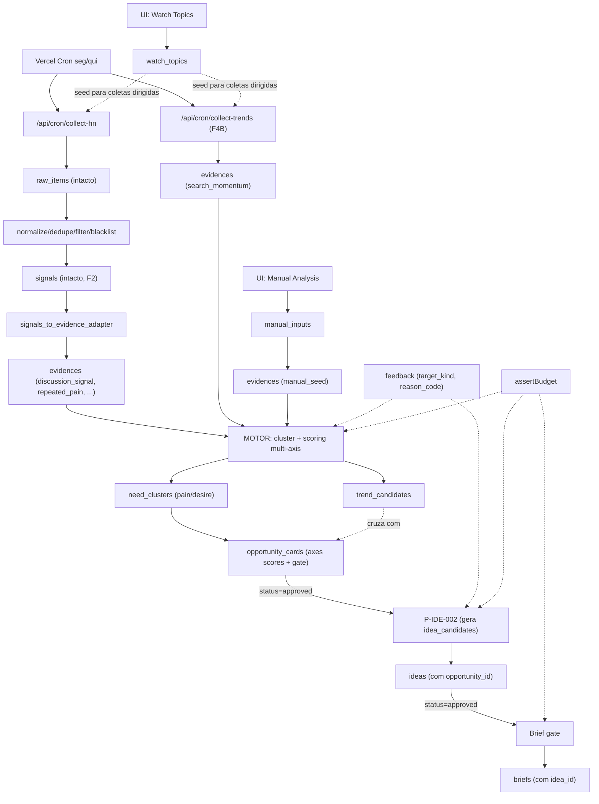
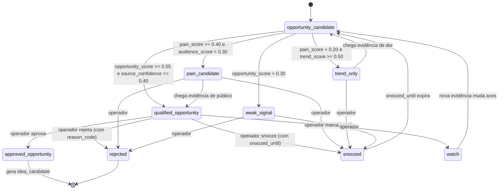

# F4 — Opportunity Motor (arquitetura)

> **Status:** Proposta aprovada pelo operador em 2026-05-06.
> **Owner do documento:** Agent 0 (Orchestrator).
> **Escopo:** arquitetura conceitual e técnica das fases **F4A**, **F4B** e **F4C** do GoMVP.
> **Fonte canônica de produto:** [`docs/PRD.md`](../PRD.md). Quando este arquivo divergir do PRD, **PRD vence** e este arquivo deve ser corrigido.

---

## 0. Frase guia

> *"Você ganha dinheiro resolvendo dor dos outros. O GoMVP precisa encontrar dor/necessidade antes de sugerir produto."*

A unidade central do produto **deixa de ser `idea`** e **passa a ser `opportunity`**.
Ideia só nasce a partir de oportunidade aprovada. Brief só nasce a partir de ideia aprovada.

---

## 1. Mudança estratégica em uma página

### Fluxo antigo (V1, hoje)

```
raw_items → signals → clusters → ideas → ranking → brief
```

- Tudo gira em torno de “gerar ideias plausíveis”.
- Nada impede que uma tendência sem dor vire ideia.
- Não há cap entre tendência e oportunidade.
- Sistema não consegue dizer “não há oportunidade aqui”.

### Fluxo novo (V2, este redesign)

```
raw_items
  → evidences (camada source-agnostic)
  → trend_candidates  (somente sinal temporal)
  → need_clusters     (agrupamentos de dor/necessidade)
  → opportunity_cards (oportunidade qualificada, multi-axis)
  → idea_candidates   (somente após approved_opportunity)
  → approved_ideas    (somente após review humano)
  → MVP briefs        (somente após idea_allowed → brief_allowed)
```

- O motor central trabalha em cima de `evidences`, **não** em cima de fonte específica.
- Tendência **não vira ideia**: vira `trend_only` se não houver dor associada.
- Operador pode marcar gates intermediários (`watch`, `snoozed`, `qualified_opportunity`).
- Sistema pode dizer: "essa tendência não tem dor associada — não há oportunidade".

---

## 2. Princípios de arquitetura

1. **Source-agnostic core.** O pipeline central nunca importa nada específico de HN, Trends, Reddit, PH, YouTube ou Reviews. Cada fonte tem seu **collector** + **normalizer** que produz `Evidence`. Daí pra frente o motor é único.
2. **Evidence é nova camada.** Não substitui `signals`. `signals` continua existindo (e, em F4A, vira **uma** das fontes de evidência via adapter HN). Outras fontes em F4B/F5 produzem evidence **direto**, sem passar por `signals`.
3. **Scoring multi-axis.** Sai o `total_score` único. Entram seis scores independentes: Trend, Pain, Audience, Source Confidence, Launchability, Opportunity (composto).
4. **Gates explícitos.** Estados nomeados (`trend_only`, `pain_candidate`, `opportunity_candidate`, etc.) substituem o "ranking opaco". Cada gate tem regra clara.
5. **Cross-source confidence é gate de qualidade, não decoração.** HN-only **não** dá confiança alta. F4B (Google Trends) é parte mínima para validar a leitura cross-source.
6. **Manual seed ≠ validação externa.** Watch topics e manual inputs **iniciam** investigação, mas **não** elevam Source Confidence. Servem como semente, não como prova de mercado.
7. **Reuso máximo.** O que já está em produção (`runs`, `ai_usage_logs`, `cost_budgets`, `sources`, `raw_items`, `blacklist_terms`, `prompts`, `weights`, `AIProvider`, `assertBudget`, dedupe genérico, blacklist genérica, embeddings) **não** é reescrito. Apenas a camada acima é nova.
8. **UI funil paralela.** As 15 telas atuais (F3) ficam read-only durante a transição. A nova navegação “Funil” (Radar / Watch / Manual / Trends / Pain Clusters / Opportunities / Ideas / Briefs / Feedback / Source Confidence) sobe ao lado.
9. **Custo IA na validação F4/F5.** O **alvo operacional** documentado é **US$ 5/mês** (D-16) enquanto o motor é validado — valor **configurável** via ENV e `cost_budgets.monthly_budget_usd`, **não** regra eterna hardcoded no código. Cross-source amplia evidences/embeddings; revisar cap antes de subir F5 pesado.

---

## 3. Diferença entre `signals` e `evidences`

| Aspecto | `signals` (atual, V1) | `evidences` (novo, F4A) |
|---|---|---|
| Origem | Apenas `raw_items` HN, via `extract.ts`. | Qualquer fonte: HN (via signal adapter), Trends, PH, Reddit, YouTube, Reviews, manual. |
| Função | Texto extraído com `pain/desire/relevance_b2c/signal_strength` para entrar em embeddings/clusters/ideas. | **Unidade atômica de prova** que alimenta Trend Score, Pain Score, Audience Score, Source Confidence. |
| Tipo | Implícito (todo signal é tratado igual). | **Tipado** via `evidence_type` (11 tipos: ver §6). |
| Relacionamento | `signals → clusters → ideas`. | `evidences → trend_candidates / need_clusters → opportunity_cards → idea_candidates`. |
| Embedding | Vetor obrigatório (1536) em `signals.embedding`. | Vetor opcional (depende do tipo: discussão → sim, search momentum → não). |
| Persistência | Mantida intacta. **Nada é renomeado.** | Nova tabela `evidences`. Coexiste. |
| Adapter | — | F4A cria `signals_to_evidence_adapter` que, para cada `signal` ready, gera `evidence(evidence_type='discussion_signal', source='hn', ...)`. |

**Regra dura:** Em F4A, `signals` continua sendo gerada normalmente pelo pipeline atual (HN). O adapter rola depois e produz `evidences` correspondentes. O motor **nunca** lê `signals` direto — sempre `evidences`.

---

## 4. Fluxo de dados completo



---

## 5. Modelo de dados

### 5.1 Tabelas reaproveitadas **sem alteração**

| Tabela | Uso em F4 |
|---|---|
| `runs` | Continua. Novos `kind`: `evidence_extract`, `trend_collect`, `need_cluster`, `opportunity_score`. |
| `ai_usage_logs` | Continua. Novas `operation`: `evidence_extract`, `trend_summary`, `opportunity_score`, `brief_v2`. |
| `cost_budgets` | Continua. Valor mensal efetivo vem de **ENV + linha do mês**; na validação F4/F5 o alvo típico é **US$ 5** (D-16), configurável. |
| `sources` | Continua. Ganha `kind='trends'`, `kind='manual'`, `kind='watch'`. |
| `raw_items` | Continua. Não muda nada. |
| `blacklist_terms` | Continua. `scope` ganha valor `'evidence'` em F4A para filtrar evidences. |
| `prompts` | Continua. Novas entradas: `P-EVI-001`, `P-TRD-001`, `P-OPP-001`, `P-IDE-002`, `P-BRF-002`. |
| `weights` | Continua. Novos pesos por axis e por gate. |
| `signals`, `clusters`, `signal_cluster` | **Intactos.** Continuam sendo gerados pelo pipeline F2. Em F4A apenas servem de **input** para o adapter `signals → evidences`. |
| `briefs` | Continua. Apenas o **gate** muda (regra de domínio). |

### 5.2 Tabelas **novas** propostas (F4A)

> Esta seção é **proposta** para revisão técnica. Schema final só é aplicado depois do brief de Agent 8 ser aprovado e da migration ser exibida em SQL antes de aplicar (DP-02).

```sql
-- 5.2.1 Watch topics: temas que o operador quer rastrear ativamente
watch_topics(
  id uuid pk,
  topic_key text not null,           -- slug estável: ex.: "pdf-merge"
  topic_label text not null,         -- humano: "Ferramentas para juntar PDFs"
  language text default 'all',
  market text default 'global',      -- 'br' | 'global' | ...
  status text default 'active',      -- 'active' | 'paused' | 'archived'
  notes text,
  created_at timestamptz default now(),
  updated_at timestamptz default now(),
  unique (topic_key)
)

-- 5.2.2 Manual inputs: insumos avulsos jogados pelo operador para análise
manual_inputs(
  id uuid pk,
  input_kind text not null,          -- 'topic' | 'text' | 'url'
  payload text not null,             -- texto original
  source_url text,
  language text default 'other',
  watch_topic_id uuid null fk watch_topics(id),
  status text default 'pending',     -- 'pending' | 'processed' | 'discarded'
  created_at timestamptz default now()
)

-- 5.2.3 Evidence layer (CORE source-agnostic)
evidences(
  id uuid pk,
  source_key text not null,          -- 'hn' | 'gtrends' | 'ph' | 'reddit' | 'youtube' | 'reviews' | 'manual' | 'watch'
  source_item_id text,               -- id externo, opcional
  source_ref text,                   -- url canonical
  evidence_type text not null,       -- ver §6
  topic_key text,                    -- amarra com watch_topics quando aplicável
  topic_label text,                  -- humano
  observed_at timestamptz not null,
  language text default 'other',
  market text default 'global',
  summary text,                      -- 1-3 frases
  pain_text text,                    -- dor explícita extraída, quando houver
  desire_text text,                  -- desejo/alternativa pedida, quando houver
  audience_hint text,                -- pista de quem sofre
  quote_excerpt text,                -- citação literal curta, quando aplicável
  strength numeric(4,3) default 0,   -- 0..1: força do sinal isolado
  confidence numeric(4,3) default 0, -- 0..1: confiança no parsing/extracao
  axes_json jsonb default '{}'::jsonb,    -- contribuição parcial para axes (trend/pain/audience)
  metrics_json jsonb default '{}'::jsonb, -- métricas brutas: 'gtrends_value', 'hn_points', 'subreddit_score'...
  metadata_json jsonb default '{}'::jsonb,-- demais metadados específicos da fonte
  raw_item_id uuid null fk raw_items(id),  -- quando vier de raw_items (HN)
  signal_id uuid null fk signals(id),      -- quando vier do adapter signals → evidences
  manual_input_id uuid null fk manual_inputs(id),
  watch_topic_id uuid null fk watch_topics(id),
  embedding vector(1536),            -- opcional, depende do evidence_type
  blacklist_tags text[] default '{}',
  created_at timestamptz default now(),
  unique (source_key, coalesce(source_item_id,''), evidence_type)
)
-- índices: (topic_key), (evidence_type), (observed_at desc),
--          gin (blacklist_tags), ivfflat (embedding) onde existir.

-- 5.2.4 Trend candidates: read-model temporal (mantém histórico leve)
trend_candidates(
  id uuid pk,
  topic_key text not null,
  topic_label text not null,
  market text default 'global',
  language text default 'other',
  window_kind text not null,         -- '24h' | '7d' | '14d' | '30d'
  trend_score numeric(4,3) default 0,-- 0..1
  recency numeric(4,3) default 0,
  frequency numeric(4,3) default 0,
  acceleration numeric(4,3) default 0,
  persistence numeric(4,3) default 0,
  source_diversity numeric(4,3) default 0,
  evidence_count int default 0,
  computed_at timestamptz default now(),
  unique (topic_key, window_kind, market, computed_at)
)

-- 5.2.5 Need clusters: agrupamentos por dor/desejo (não confundir com clusters F2)
need_clusters(
  id uuid pk,
  label text,
  summary text,
  pain_summary text,
  audience_summary text,
  topic_key text,                    -- chave macro quando há
  topic_tags text[] default '{}',
  evidence_count int default 0,
  coherence_score numeric(4,3),
  status text default 'active',      -- 'active' | 'archived'
  created_at timestamptz default now(),
  updated_at timestamptz default now()
)

evidence_clusters(
  evidence_id uuid not null fk evidences(id) on delete cascade,
  need_cluster_id uuid not null fk need_clusters(id) on delete cascade,
  distance numeric(8,6),
  primary_evidence boolean default false,
  primary key (evidence_id, need_cluster_id)
)

-- 5.2.6 Opportunity cards: NÚCLEO do novo fluxo
opportunity_cards(
  id uuid pk,
  need_cluster_id uuid null fk need_clusters(id),
  trend_candidate_id uuid null fk trend_candidates(id),
  topic_key text,
  topic_label text not null,
  pain_summary text,
  audience_summary text,
  market text default 'global',
  language text default 'other',

  -- axes scores
  trend_score        numeric(4,3) default 0,
  pain_score         numeric(4,3) default 0,
  audience_score     numeric(4,3) default 0,
  source_confidence  numeric(4,3) default 0,
  launchability_score numeric(4,3) default 0,
  opportunity_score  numeric(4,3) default 0,

  axes_json jsonb default '{}'::jsonb,        -- detalhes/justificativa por axis
  evidence_count int default 0,
  source_count int default 0,

  -- gate state
  gate_state text not null default 'opportunity_candidate',
  -- valores válidos: trend_only | watch | weak_signal | pain_candidate
  --                  | opportunity_candidate | qualified_opportunity
  --                  | approved_opportunity | rejected | snoozed
  snoozed_until timestamptz,
  reason_codes text[] default '{}',  -- razões agregadas do operador (ver §10)
  notes text,

  blacklist_tags text[] default '{}',
  created_at timestamptz default now(),
  updated_at timestamptz default now()
)

opportunity_evidences(
  opportunity_id uuid not null fk opportunity_cards(id) on delete cascade,
  evidence_id uuid not null fk evidences(id) on delete cascade,
  contribution_json jsonb default '{}'::jsonb,
  primary key (opportunity_id, evidence_id)
)
```

### 5.3 Tabelas **alteradas** (com migrations dedicadas, sob aprovação)

#### `ideas` (em F4A)

- Adicionar `opportunity_id uuid null fk opportunity_cards(id)`.
- Para ideias **legadas** (geradas em F2), `opportunity_id IS NULL`.
- Para ideias **novas** (geradas em F4A em diante), `opportunity_id` é **obrigatória** por regra de domínio (validação na Server Action / pipeline). Não é `NOT NULL` no schema para preservar legado.
- Adicionar `gate_state text default 'idea_candidate'` (valores: `idea_candidate | idea_allowed | rejected | snoozed`).
- `total_score` continua mas deixa de ser o único; serve agora como **score derivado** apenas para legado e para ranking interno do funil (não substitui `opportunity_score`).

#### `briefs` (em F4C)

- **Sem alteração de schema.** Apenas regra de domínio: brief só é gerado quando `ideas.gate_state='idea_allowed'`. A regra entra na rota `/api/brief/generate` (server action ou route handler).

#### `feedback` (em F4C, migration dedicada)

A tabela atual é flat e amarrada a `idea_id`. Em F4C ela vira polimórfica:

```sql
-- Migration F4C
alter table feedback
  add column target_kind text,           -- 'evidence' | 'trend' | 'opportunity' | 'idea'
  add column target_id   uuid,
  add column reason_code text,           -- ver §10 reason codes
  add column gate_after  text;           -- 'approved' | 'rejected' | 'snoozed' | 'watch' | ...

-- backfill: feedback antigo vira (target_kind='idea', target_id=idea_id)
update feedback set target_kind='idea', target_id=idea_id where target_kind is null;

-- target_kind/target_id viram NOT NULL após backfill validado
alter table feedback
  alter column target_kind set not null,
  alter column target_id   set not null;

-- idea_id permanece para compatibilidade com /ideias/[id]/actions.ts existente,
-- mas pode ser depreciada em F5+
```

---

## 6. Tipos de evidência

`evidence_type` é o vocabulário central que o motor entende. Em F4A entram **5 tipos mínimos**; os demais ficam declarados mas só populam quando a fonte respectiva entra (F4B/F5).

| Tipo | F4A | F4B | F5 | Quem produz |
|---|---|---|---|---|
| `discussion_signal` | sim | sim | sim | Adapter HN; depois Reddit/YouTube. Indica que pessoas estão discutindo o tema. |
| `repeated_pain` | sim | sim | sim | Detecção em discussão (pain_text não-nulo + recorrência). |
| `manual_seed` | sim | sim | sim | UI Manual Analysis. **Não eleva source_confidence externa.** |
| `workaround_signal` | sim | sim | sim | Discussão menciona gambiarra/workaround. |
| `alternative_request` | sim | sim | sim | Pedido explícito por alternativa ("anyone knows a tool that..."). |
| `search_momentum` | — | sim | sim | Google Trends (F4B). Indica sinal de busca/interesse. |
| `solution_supply` | — | — | sim | Product Hunt (F5A). Indica oferta surgindo no mesmo nicho. |
| `content_demand` | — | — | sim | YouTube comments / search (F5C). Linguagem do público. |
| `competitor_weakness` | — | — | sim | Reviews (F5D). Reclamação sobre players existentes. |
| `pricing_complaint` | — | sim | sim | Heurística em discussion/reviews. |
| `process_manual_work` | — | sim | sim | Heurística em discussion. |

---

## 7. Scoring multi-axis

Hoje há um `total_score ∈ [0,1]`. Em F4 ele **continua existindo no nível `idea`** (legado) mas o motor passa a operar com **6 axes independentes em `opportunity_cards`**.

### 7.1 Trend Score — "isso está se movendo?"

Inputs: agregados sobre evidences associadas ao mesmo `topic_key` em janelas temporais.

```
trend_score = clamp01(
   w_recency      * recency
 + w_frequency    * frequency
 + w_acceleration * acceleration
 + w_persistence  * persistence
 + w_diversity    * source_diversity
)
```

- `recency`: decaimento exponencial vs `observed_at` mais recente.
- `frequency`: nº de evidences no período / capacidade esperada da fonte.
- `acceleration`: derivada (24h vs 7d, 7d vs 30d) normalizada.
- `persistence`: presença em ≥3 janelas seguidas.
- `source_diversity`: nº de `source_key` distintos (manual/watch **não** contam).

Pesos default sugeridos (configuráveis em `weights`): `recency=0.25, frequency=0.20, acceleration=0.20, persistence=0.20, diversity=0.15`.

### 7.2 Pain Score — "existe dor/necessidade?"

Inputs: subset de evidences com `pain_text != null` ou `evidence_type ∈ {repeated_pain, workaround_signal, alternative_request, pricing_complaint, process_manual_work, competitor_weakness}`.

```
pain_score = clamp01(
   w_explicit_complaint * explicit_complaint_ratio
 + w_alternative_req    * alternative_request_density
 + w_workaround         * workaround_density
 + w_cost_time          * cost_time_signals
 + w_urgency            * urgency_signals
 + w_repetition         * repetition_factor
)
```

- `repetition_factor`: nº de evidences distintas com a mesma dor / threshold (default 3).
- O motor **nunca** infere dor onde não há texto. `pain_text=null` em todas evidences ⇒ `pain_score=0` ⇒ `gate_state='trend_only'`.

### 7.3 Audience Score — "quem sofre com isso?"

Inputs: agregados de `audience_hint` + heurística de mercado.

```
audience_score = clamp01(
   w_clarity        * audience_clarity
 + w_niche          * niche_identifiability
 + w_acquirability  * acquisition_capability
 + w_market_fit     * market_fit (ptbr | global)
 + w_buyer_clarity  * buyer_clarity
)
```

- `audience_clarity`: nº de evidences com `audience_hint != null` / total.
- `niche_identifiability`: similaridade entre `audience_hint` (cosine sobre embeddings).
- `acquisition_capability`: heurística por canal plausível (web-first, comunidade, SEO).
- `market_fit`: 1.0 se PT-BR ou global, 0.5 se restrito a mercado de difícil aquisição.
- `buyer_clarity`: B2C claro vs misto.

### 7.4 Source Confidence — "isso aparece em mais de um tipo de fonte?"

**Esta é a barreira contra certeza falsa.**

```
distinct_external = nº de source_key distintos em ['hn','gtrends','ph','reddit','youtube','reviews']
                    -- 'manual' e 'watch' NÃO entram nessa contagem.

source_confidence =
  0.40 se distinct_external == 1
  0.65 se distinct_external == 2
  0.80 se distinct_external == 3
  0.90 se distinct_external >= 4
```

- F4A (HN-only) ⇒ qualquer opportunity terá `source_confidence ≤ 0.40`. Por construção, **opportunity_score** terá teto explícito enquanto F4B não rodar.
- Manual seed e watch topic **não elevam** `source_confidence`. Se a única evidência for manual/watch, `source_confidence = 0.20` (sinal honesto: "tu inventaste, ainda não validou").

### 7.5 Launchability Score — "isso cabe em microproduto IndieLab?"

Inputs: heurísticas determinísticas + 1 chamada IA (P-OPP-001) que avalia restrições.

```
launchability_score = clamp01(
   w_solo            * solo_dev_feasible
 + w_mvp_window      * mvp_in_1_to_2_weeks
 + w_low_support     * low_support
 + w_web_first       * web_first
 + w_low_custom      * low_customization
 + w_low_risk        * low_risk
 + w_simple_money    * simple_monetization
 + w_channel         * plausible_channel
 + w_no_heavy_int    * no_heavy_integration
 + w_no_jur_risk     * no_jur_med_fin_risk
)
```

- Categorias bloqueadas por **D-10 / blacklist** zeram `launchability_score` automaticamente.
- Sem isso, fica fácil o motor inflar `opportunity_score` com algo que viola PRD §6.1.

### 7.6 Opportunity Score — composto final

```
opportunity_score = clamp01(
   w_trend         * trend_score
 + w_pain          * pain_score
 + w_audience      * audience_score
 + w_source        * source_confidence
 + w_launch        * launchability_score
 - w_risk_penalty  * risk_penalty
)
```

- `risk_penalty`: 0..1, calculado de `lgpd_risk + monetization_weak + saturated_market` quando aplicável.
- Pesos default sugeridos: `trend=0.10, pain=0.30, audience=0.15, source=0.20, launch=0.20, risk_penalty=0.20`.
- **Pain pesa mais que trend.** É o ponto da virada estratégica.

---

## 8. Gates e estados (state machine)



### Regras duras

- **Idea só nasce de `approved_opportunity`.** Nenhuma rota chama `runIdeaGeneration` em opportunity que não esteja `approved_opportunity`.
- **Brief só nasce de `idea_allowed`.** Ideia precisa ser aprovada pelo operador (`gate_state='idea_allowed'`) antes do brief.
- **`source_confidence < 0.40` não satisfaz o gate mínimo para `qualified_opportunity`** (ver pesos `f4_gate_*`). Oportunidades abaixo disso podem permanecer em `opportunity_candidate` ou estados inferiores, sempre com comunicação honesta de confiança.
- **F4A (HN-only):** toda oportunidade em `qualified_opportunity` deve exibir na UI **Baixa confiança de fonte** (badge ou estado dedicado em PT-BR). **`source_confidence` no teto (ex.: 0,40 com uma fonte externa) valida encruzilhada técnica do motor, não prova de mercado amplo.**
- **`launchability_score = 0`** (categoria bloqueada) força `gate_state='rejected'` automático com `reason_code='not_indielab_fit'` ou `'regulatory_risk'`.

---

## 9. Source Confidence: trace e auditoria

Cada `opportunity_card` deve permitir auditoria completa:

- Quais evidências contribuíram?
- De quais fontes externas distintas?
- Quais axes contribuíram com quanto?
- Quais reasons o operador já aplicou no histórico desse `topic_key`?

UI dedicada: tela **"Source Confidence / Evidence Trace"** lista as evidences vinculadas (via `opportunity_evidences`) com `source_key`, `evidence_type`, `summary`, `quote_excerpt`, `observed_at` e link para `source_ref`.

---

## 10. Feedback estruturado e reason codes

### 10.1 Níveis de feedback

```
feedback.target_kind ∈ { 'evidence', 'trend', 'opportunity', 'idea' }
```

- `evidence`: marcar evidência como ruído ou útil. Penalidade leve no parsing futuro do mesmo `source_key+evidence_type`.
- `trend`: aprovar ou rejeitar `trend_candidate`. Não cria opportunity.
- `opportunity`: gate principal. Aprovar / rejeitar / promissora / watch / snoozed.
- `idea`: aprovar / rejeitar (mantém compatibilidade F2/F3).

### 10.2 Reason codes (vocabulário fechado)

```
pain_weak | audience_unclear | too_generic | too_enterprise | too_b2b
| build_heavy | integration_heavy | support_heavy | regulatory_risk
| monetization_weak | channel_weak | evidence_insufficient | source_bias
| trend_only_no_pain | good_trend_bad_opportunity | good_pain_bad_idea
| saturated_market | not_indielab_fit | interesting_but_not_now
```

- Aprovação **e** rejeição exigem reason code (UI obriga).
- Reason codes **agregam** em `opportunity_cards.reason_codes` para evitar oferecer de novo a mesma oportunidade sem motivo.
- Ranking futuro pode descontar `opportunity_score` quando `reason_codes` recorrentes existirem para `topic_key` semelhante.

### 10.3 Sem treinar modelo

Mantém DP-10 do projeto. Aprendizado vem de:
1. Regras editáveis (peso por axis, threshold por gate).
2. Few-shot dinâmico em P-OPP-001 e P-IDE-002 (top N approved/rejected).
3. Embeddings de preferência: centroides por `topic_key` em `feedback`. Subscore `preference_affinity` cap ±0.05.

---

## 11. Pipeline source-agnostic

Arquitetura de pastas proposta (sob aprovação do Agent 8):

```
src/
├── sources/                           ← NOVA pasta source-agnostic
│   ├── hn/
│   │   ├── collector.ts               ← (move de src/collectors/algolia-hn.ts em F4B+, ou wrapper em F4A)
│   │   ├── normalizer.ts              ← HN payload → raw_items
│   │   └── signal-to-evidence.ts      ← adapter signals → evidences
│   ├── gtrends/                       ← F4B
│   │   ├── collector.ts               ← google-trends-api ou similar (sob aprovação de pacote)
│   │   ├── normalizer.ts              ← Trends → evidences direto (search_momentum)
│   │   └── README.md
│   ├── manual/
│   │   └── normalizer.ts              ← manual_inputs → evidences (manual_seed)
│   └── watch/
│       └── normalizer.ts              ← watch_topics → evidences (manual_seed leve)
├── motor/                             ← NOVA pasta do motor
│   ├── evidence-store.ts              ← upsert evidences + dedupe
│   ├── trend-engine.ts                ← computa trend_candidates
│   ├── need-cluster.ts                ← computa need_clusters
│   ├── opportunity-score.ts           ← computa axes scores
│   ├── opportunity-gate.ts            ← state machine §8
│   └── prompts.ts                     ← orchestra P-EVI / P-TRD / P-OPP
├── pipeline/                          ← intacto (F2)
├── collectors/                        ← intacto (F2)
└── ai/                                ← intacto
```

`src/pipeline/*` e `src/collectors/*` **não** são alterados em F4A. Apenas adicionamos `src/sources/` e `src/motor/`. O Agent 8 pode propor mover a partir de F4B se fizer sentido.

---

## 12. Adaptação do dataset legado

Decisão: **coexistir como legado read-only** (DR-06).

Em F4A:

1. Pipeline F2 (`extract` + `embed` + `cluster` + `ideaGen`) continua rodando normalmente em cron.
2. Após `extract`, novo passo `signals-to-evidence` produz `evidences(...)` **somente para `signals` novos** após o go-live do adapter — **sem backfill retroativo** do histórico em F4A. Um job futuro de backfill (opcional) exige **dry-run + aprovação separada** do operador.
3. Motor F4 lê `evidences` (não `signals`).
4. Telas legadas (`/ranking`, `/ideias/[id]`, `/sinais`, `/clusters`, `/brief/[ideaId]`) continuam mostrando dados legados (sem `opportunity_id`). Marcadas com badge `LEGADO`.
5. Após F4A estável + F4B aprovado, operador decide se desliga `ideaGen` automático (legado) e força "ideias só via opportunity".

Sem perda de dados. Sem migration destrutiva.

---

## 13. Fases F4A / F4B / F4C

### F4A — Motor Base / Evidence Layer (HN-only)

**Owner:** Agent 8.
**Tempo estimado:** 5–7 dias.
**Custo IA esperado:** US$ 0,5–1,5/mês marginal (P-EVI + P-OPP em volume baixo, dado HN-only).

Entrega:

- Migration F4A (**SQL preview obrigatório**; **aplicação** só após **aprovação explícita e específica** do operador por migration — não há autorização genérica):
- Pasta `src/sources/hn/` com signal-to-evidence adapter.
- Pasta `src/sources/manual/` + `src/sources/watch/`.
- Pasta `src/motor/` com trend-engine, need-cluster, opportunity-score, opportunity-gate.
- Prompts versionados `001`: `P-EVI-001`, `P-TRD-001`, `P-OPP-001`.
- Pesos default por axis seedados em `weights`.
- Endpoints:
  - `/api/cron/build-evidence` (após `extract`, ainda em seg/qui).
  - `/api/cron/score-opportunities` (após `generate`, ainda em seg/qui).
  - `/api/manual/analyze` (route handler **fora do cron**, autenticado, só operador).
- UI nova nav "Funil":
  - **/funil/radar** — overview (counts por gate, top opportunity_score).
  - **/funil/watch-topics** — CRUD de watch_topics.
  - **/funil/manual** — input manual on-demand.
  - **/funil/trends** — listagem trend_candidates.
  - **/funil/need-clusters** — listagem need_clusters.
  - **/funil/opportunities** — ranking de opportunity_cards.
  - **/funil/opportunities/[id]** — detalhe + axes + evidence trace + ações de gate. **F4A:** `qualified_opportunity` sempre com **Baixa confiança de fonte** visível.
  - **/funil/source-confidence** — auditoria fonte por opportunity.
- F3 antiga continua acessível, marcada como `LEGADO` na sidebar.

Gates F4A:

- [ ] Adapter produz `evidences` **apenas para `signals` novos** (sem backfill retroativo). Smoke: amostra ≥ **10** evidences em run de teste documentada.
- [ ] ≥ 1 opportunity_card com `gate_state='qualified_opportunity'` em dataset de teste (mesmo com HN-only).
- [ ] **UI:** toda `qualified_opportunity` em F4A exibe **Baixa confiança de fonte**.
- [ ] Source Confidence ≤ 0.40 nesta fase para evidência externa única (assertion HN-only).
- [ ] `assertBudget()` bloqueia em teste (≥ 0.90 cron, ≥ 1.00 hard) no **cap vigente** configurado.
- [ ] Telas funil sobem todas com loading/empty/error.
- [ ] Manual analysis on-demand funciona end-to-end (input → evidence → opportunity stub).

Saída F4A: `docs/handback/F4A_DONE.md` + revisão Agent 5.

### F4B — Cross-source mínimo com Google Trends

**Owner:** Agent 9.
**Tempo estimado:** 4–6 dias.
**Custo IA esperado:** marginal (Trends é gratuito; embeddings extras moderados).

Entrega:

- Pasta `src/sources/gtrends/` com collector + normalizer.
- Endpoint `/api/cron/collect-trends` (cadência: piggyback em seg/qui ou independente, sob decisão).
- Evidence type `search_momentum` populando.
- Atualização em `opportunity_score` para considerar `search_momentum` na composição.
- UI: **/funil/trends** passa a mostrar trends cruzadas com discussion (HN + GT).
- Documentação de rate-limit, fallback e custo zero.

Gates F4B:

- [ ] ≥ 1 opportunity_card com `source_confidence ≥ 0.65` (HN + GT).
- [ ] Demonstrar caso "trend forte sem dor" → `gate_state='trend_only'` correto.
- [ ] Demonstrar caso "dor sem trend" → `gate_state='pain_candidate'` correto.

Saída F4B: `docs/handback/F4B_DONE.md` + revisão Agent 5.

### F4C — Feedback estruturado + Idea/Brief gates

**Owner:** Agent 10.
**Tempo estimado:** 3–5 dias.

Entrega:

- Migration F4C (**mesma política de aprovação per-migration** que F4A): alteração em `feedback` (target_kind / target_id / reason_code / gate_after).
- Backfill seguro do feedback antigo.
- UI: ações no detalhe de opportunity → escolher reason_code obrigatório.
- UI: tela **/funil/feedback-history** (auditoria por target).
- Implementar gate **idea_allowed** em `ideas`. Implementar gate **brief_allowed** na geração de brief.
- Prompt `P-IDE-002` (gera idea só de `opportunity_card`) + `P-BRF-002` (gera brief só de `idea_allowed`).
- Few-shot dinâmico em P-OPP-001/P-IDE-002 baseado em reasons.

Gates F4C:

- [ ] Brief não gera para opportunity sem dor.
- [ ] Idea não gera para opportunity rejected.
- [ ] Aprovação/rejeição obriga reason_code (validação Zod).
- [ ] 2 ciclos de feedback movem `opportunity_score` médio do top-10.

Saída F4C: `docs/handback/F4C_DONE.md` + revisão Agent 5. **F4 fechada** somente após F4C aprovado.

---

## 14. Telas (mapa rápido)

| Grupo | Tela | Fase | Origem dos dados |
|---|---|---|---|
| **Funil** | Radar (overview) | F4A | aggregations sobre `opportunity_cards`, `evidences` |
| **Funil** | Watch Topics | F4A | `watch_topics` (CRUD) |
| **Funil** | Manual Analysis | F4A | `manual_inputs` + endpoint on-demand |
| **Funil** | Trends | F4A → F4B | `trend_candidates` |
| **Funil** | Pain/Need Clusters | F4A | `need_clusters` |
| **Funil** | Opportunities | F4A | `opportunity_cards` |
| **Funil** | Opportunity Detail | F4A | `opportunity_cards` + `opportunity_evidences`; **badge Baixa confiança de fonte** em `qualified_opportunity` (HN-only) |
| **Funil** | Source Confidence / Evidence Trace | F4A | derivado de `evidences` por opportunity |
| **Funil** | Ideas (do funil) | F4C | `ideas` com `opportunity_id NOT NULL` |
| **Funil** | Briefs (do funil) | F4C | `briefs` derivados de `idea_allowed` |
| **Funil** | Feedback History | F4C | `feedback` polimórfico |
| **Operação (legado)** | Dashboard, Ranking, Detalhe, Filtradas, Brief | F3 | continua. Badge `LEGADO`. |
| **Pipeline (legado)** | Sinais, Clusters, Runs | F3 | continua. |
| **Configuração** | Fontes, Pesos, Blacklist, Prompts | F3 | continua. Pesos novos por axis em **/pesos**. |
| **Sistema** | Custos, Configurações | F3 | continua. |

UI deve sempre reforçar:

- "Score IA não é validação real. Validação real exige clique, cadastro, uso, retorno, pagamento ou compartilhamento."
- "Opportunity ≠ MVP. Brief ≠ validação."

---

## 15. Prompts novos (esqueleto)

Todos versão `001`. Versionados em `src/prompts/` + `prompts` (DB). Salvos em `ai_usage_logs.prompt_version`.

### P-EVI-001 — Extração de evidência (uso por evidence_type relevante)

Entrada: `(source_key, source_ref, raw_text, language)`.
Saída JSON estrita: `{ evidence_type, summary, pain_text, desire_text, audience_hint, quote_excerpt, strength, confidence, axes_json, language }`.

### P-TRD-001 — Resumo de trend candidate

Entrada: lista de evidências do mesmo `topic_key` em janela.
Saída: `{ topic_key, topic_label, summary, why_now, top_evidence_ids[] }`.

### P-OPP-001 — Avaliação de opportunity

Entrada: need_cluster + (opcional) trend_candidate + amostra de evidências.
Saída JSON estrita com axes scores + justificativa por axis + recomendação de gate.

### P-IDE-002 — Geração de ideia (apenas em F4C)

Substitui semanticamente P-IDE-001. Recebe `opportunity_card` aprovado; gera até 3 ideias **com `opportunity_id`**. Mesmo schema atual + campo `opportunity_id` no JSON.

### P-BRF-002 — Brief MVP (apenas em F4C)

Substitui P-BRF-001. Mesmo schema; só dispara se `idea.gate_state='idea_allowed'`.

---

## 16. Custos esperados

| Fase | Operação IA principal | Volume estimado | Custo mensal estimado |
|---|---|---|---|
| F4A | P-EVI-001 sobre **novos** signals (pós adapter) | volume conforme coleta | ~US$ 0,20 |
| F4A | P-OPP-001 sobre opportunity_cards (~30–60/mês) | 50 chamadas × 1k tok in / 400 tok out | ~US$ 0,40 |
| F4A | P-TRD-001 sobre trend_candidates (~10–20/mês) | 15 chamadas × 800 tok | ~US$ 0,10 |
| F4B | sem IA paga (Trends API gratuita; embeddings de evidences extras) | ~500 embeddings/mês | ~US$ 0,02 |
| F4C | P-IDE-002 + P-BRF-002 (sob demanda, baixo volume) | 30 chamadas/mês | ~US$ 0,30 |
| **Total esperado F4** | | | **≤ US$ 1,5/mês** (ordem de grandeza) |

**Teto operacional:** o limite mensal efetivo é o configurado em **`cost_budgets.monthly_budget_usd` + ENV**. Durante validação F4/F5 o **alvo típico** é **US$ 5/mês** (D-16) — **não** constante hardcoded no código. Se cross-source explodir embeddings, reavaliar ENV/`cost_budgets` antes de subir F4B+.

---

## 17. Riscos e mitigações

| Risco | Severidade | Mitigação |
|---|---|---|
| Quebrar F3 ao adicionar `opportunity_id` em `ideas` | Média | Coluna nullable; queries existentes não exigem `IS NOT NULL`. Validação de domínio na app. |
| Confusão entre `signals`, `evidences`, `clusters`, `need_clusters` | Alta | Glossário neste doc + badge `LEGADO` na UI + nomes não conflitantes. |
| Source Confidence falsa em F4A | Alta | Cap automático (`distinct_external==1 ⇒ ≤0.40`). UI mostra badge "low confidence" sempre. |
| Custo IA explodir em F4B | Média | Estimar antes via dry-run; manter `assertBudget()`; F4B só sobe após Agent 8 entregar contagens reais de F4A. |
| Watch topic / manual seed inflar oportunidade | Alta | `manual_seed` **não conta** em source confidence externa. Cap explícito. |
| Migration F4A grande | Alta | Migration única, idempotente, exibida em SQL antes de aplicar (DP-02). Zero `DROP`. Apenas `CREATE` + `ALTER ADD COLUMN nullable`. |
| Operador atrofiar gate aprovação | Média | UI obriga `reason_code` em qualquer transição de gate. |
| Pipeline legado parar de gerar evidences | Média | `signals-to-evidence` no mesmo handler de `extract` (sucesso/falha conjunto). |
| Reaproveitamento de `weights` polui namespace | Baixa | Pesos novos com prefixo (`f4_trend_recency_w`, `f4_opp_pain_w`, ...). Pesos antigos mantidos. |

---

## 18. Glossário

| Termo | Definição |
|---|---|
| **Evidence** | Sinal atômico, normalizado e tipado, vindo de qualquer fonte. Unidade source-agnostic do motor. |
| **Topic key** | Slug estável que amarra evidências cross-source ao mesmo tema (ex: `pdf-merge-online`). |
| **Trend candidate** | Read-model temporal de um `topic_key` em janela (24h/7d/14d/30d). Indica movimento, não dor. |
| **Need cluster** | Agrupamento de evidências em torno de uma dor/desejo recorrente. |
| **Opportunity card** | Núcleo do funil. Combina trend + need + axes scores + gate. |
| **Source Confidence** | Quantos `source_key` externos distintos corroboram a opportunity. Manual e watch não contam. |
| **Gate** | Estado nomeado da opportunity (ou idea) na máquina de estados. |
| **Reason code** | Vocabulário fechado de motivos para feedback. |

---

## 19. O que este documento NÃO faz

- Não substitui o PRD. Mudanças que afetam D-01..D-10, KPIs e §6/§9/§17/§18/§19/§22/§24 do PRD entram via decisões `D-11..D-16` em [`DECISIONS.md`](../DECISIONS.md) e edição da rodada 7 do PRD.
- Não define UI pixel-perfect. Mapas de tela são funcionais; visual segue o sistema F3 + Figma quando existir.
- Não autoriza implementação. Implementação só após brief de Agent 8 aprovado, migration exibida e operador autorizar `db:migrate`.
